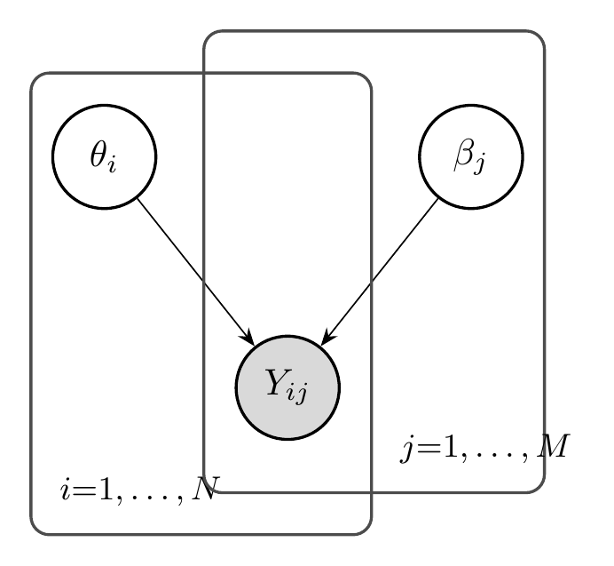
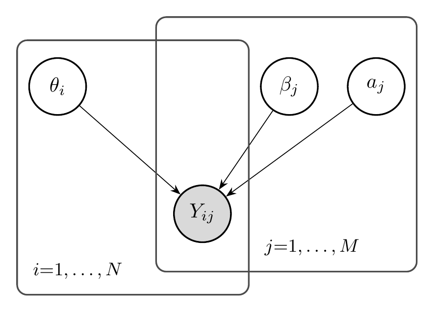
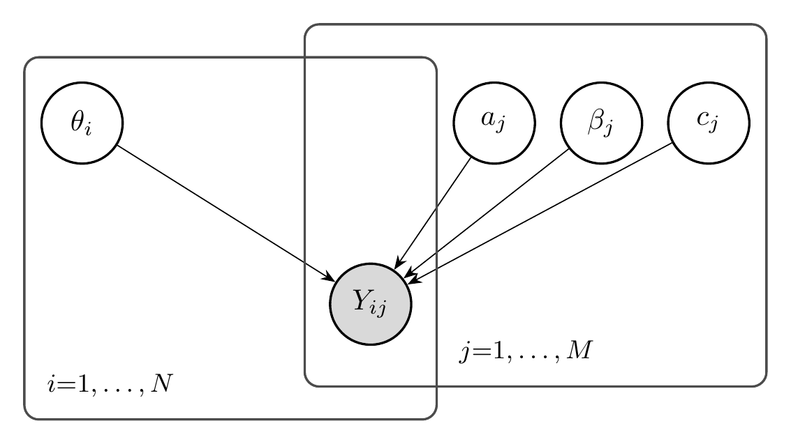
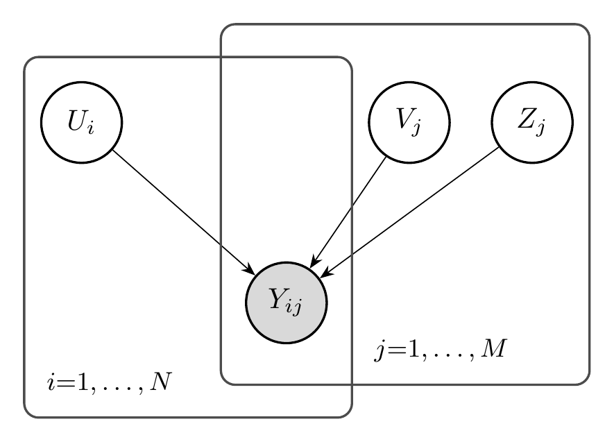
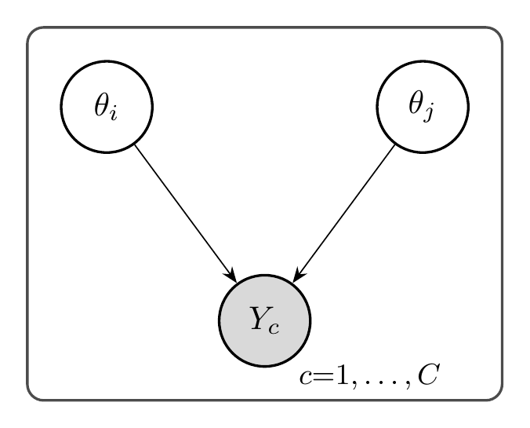
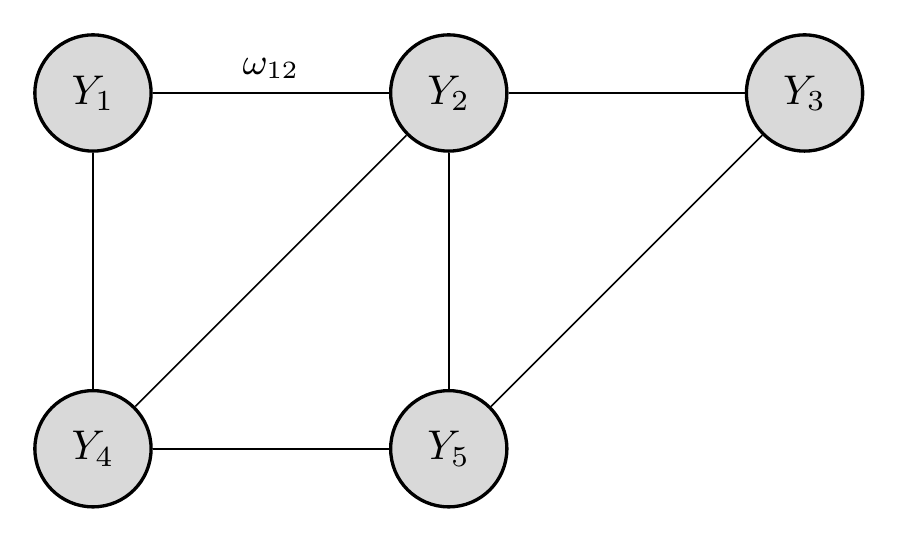

---
format:
  html:
    include-after-body:
      text: |
        <script>
        // Auto-execute all pyodide cells after initialization
        document.addEventListener('DOMContentLoaded', function() {
          // Wait for pyodide to be fully ready (mainPyodide is set after loading)
          function waitForPyodide() {
            if (typeof globalThis.mainPyodide !== 'undefined' && globalThis.mainPyodide) {
              // Pyodide is ready, execute all cells with autorun=true
              if (typeof globalThis.qpyodideCellDetails !== 'undefined') {
                globalThis.qpyodideCellDetails.forEach((cell, index) => {
                  if (cell.options && cell.options.autorun === 'true') {
                    setTimeout(() => {
                      const runButton = document.querySelector(`#qpyodide-button-run-${cell.id}`);
                      if (runButton && !runButton.disabled) {
                        runButton.click();
                      }
                    }, index * 1000); // Stagger execution by 1 second each
                  }
                });
              }
            } else {
              setTimeout(waitForPyodide, 500);
            }
          }
          setTimeout(waitForPyodide, 2000); // Start checking after 2 seconds
        });
        </script>
filters:
  - pyodide
pyodide:
  packages:
    - numpy
    - matplotlib
---

# Foundations of Measurement {#sec-foundations}

::: {.callout-note title="Intended Learning Outcomes"}
By the end of this chapter, you will be able to:

1. **Articulate** Borsboom's realist framework for validity and explain why measurement requires warrant inference about latent constructs.
2. **Distinguish** between Item Response Theory, factor models, paired comparison systems (Elo, Bradley-Terry), and network models (GGM, Ising).
3. **Explain** why the Rasch model holds a special status as "the measurement model" through the sufficiency of sum scores, specific objectivity, and test-free measurement.
4. **Derive** the sufficiency theorem for the Rasch model and explain its implications for AI benchmark evaluation.
5. **Compare** the prescriptive (Rasch school) and descriptive (general IRT) approaches to measurement and articulate when each is appropriate.
6. **Trace** the historical development from Thurstone (1927) through Rasch (1960) to modern network psychometrics.
7. **Connect** classical measurement concepts (reliability, validity, dimensionality) to contemporary AI benchmark evaluation.
8. **Apply** measurement theory to analyze whether AI benchmarks satisfy the requirements for scientific measurement.
9. **Implement** basic IRT models in Python and visualize item characteristic curves.
10. **Evaluate** the assumptions underlying AI leaderboards and identify potential violations of measurement principles.
:::

::: {.callout-tip title="Video Overview" collapse="false"}
A visual tour of the key concepts in this chapter — from response matrices and item characteristic curves to factor models and benchmark heterogeneity.


:::

::: {.callout-note title="Notation"}
This chapter introduces the core notation used throughout the book: $\theta_i$ (model ability), $\beta_j$ (item difficulty), $a_j$ (discrimination), $c_j$ (guessing), $Y_{ij}$ (binary response), and $\sigma(\cdot)$ (logistic sigmoid). See @sec-notation for the complete notation reference.
:::


## The Measurement Problem in AI {#sec-measurement-problem}

Consider the following scenario: You have evaluated 100 language models on a benchmark consisting of 1,000 multiple-choice questions. Each model either answers each question correctly (1) or incorrectly (0), producing a $100 \times 1000$ binary response matrix $Y$. You compute each model's accuracy---the proportion of correct answers---and rank the models accordingly.

Have you *measured* anything?

The answer is not as obvious as it might seem. You have certainly *scored* the models: you assigned numbers to them based on their performance. But measurement, in the scientific sense, requires more than assigning numbers. It requires that those numbers correspond to some underlying property---a *latent construct*---in a principled way.

### Scoring vs. Measuring

The distinction between scoring and measuring is fundamental to understanding why AI evaluation needs measurement science. Consider an analogy from physics: if you measure the temperature of water with a mercury thermometer, the height of the mercury column is a *score*---a number you can read off the instrument. But you trust this score as a *measurement* of temperature because you understand the relationship between mercury expansion and thermal energy.

In AI evaluation, we often have scores without this deeper understanding. When GPT-4 achieves 86% accuracy on MMLU and Claude achieves 84%, we cannot immediately conclude that GPT-4 has more "intelligence" or "capability" than Claude. Several questions must be answered first:

1. **What latent construct does MMLU measure?** Is it general intelligence, factual knowledge, test-taking ability, or something else entirely?

2. **Is the construct unidimensional?** Can model performance be characterized by a single number, or do different questions tap into different capabilities?

3. **Are the scores comparable across different test conditions?** Would the ranking change if we used different questions from the same domain?

4. **What is the measurement error?** How much of the score difference reflects true differences in capability versus noise?

These questions have been central to psychology and education for over a century. The field of *psychometrics* developed sophisticated tools---Item Response Theory, factor analysis, validity frameworks---precisely to address them. AI evaluation is now confronting the same fundamental challenges.

### The Response Matrix

The basic data structure in measurement is the *response matrix* $Y \in \{0, 1\}^{N \times M}$, where:

- Each row $i \in \{1, \ldots, N\}$ represents a *test taker* (in AI: a model)
- Each column $j \in \{1, \ldots, M\}$ represents an *item* (in AI: a benchmark question)
- Each entry $Y_{ij} \in \{0, 1\}$ indicates whether test taker $i$ answered item $j$ correctly

$$
Y = \begin{pmatrix}
Y_{11} & Y_{12} & \cdots & Y_{1M} \\
Y_{21} & Y_{22} & \cdots & Y_{2M} \\
\vdots & \vdots & \ddots & \vdots \\
Y_{N1} & Y_{N2} & \cdots & Y_{NM}
\end{pmatrix}
$$

The naive approach to evaluation computes row means (model accuracies) and ranks models accordingly. But the response matrix contains far more information than these marginal statistics. The *pattern* of responses---which models succeed on which questions---reveals structure that aggregate scores obscure.



```{pyodide-python}
#| label: response-matrix-visualization
#| autorun: true
#| fig-cap: "Response matrix from a language model evaluation. Rows are models (sorted by total score), columns are questions (sorted by difficulty). The diagonal structure suggests underlying ability and difficulty parameters."

# Simulate a response matrix with Rasch model structure
N, M = 50, 200  # 50 models, 200 questions

# Generate latent abilities and difficulties
theta = np.random.normal(0, 1, N)  # model abilities
beta = np.random.normal(0, 1.5, M)  # question difficulties

# Generate responses via Rasch model
prob = 1 / (1 + np.exp(-(theta[:, None] - beta[None, :])))
Y = (np.random.random((N, M)) < prob).astype(int)

# Sort by row and column sums
row_order = np.argsort(Y.sum(axis=1))[::-1]
col_order = np.argsort(Y.sum(axis=0))[::-1]
Y_sorted = Y[row_order][:, col_order]

# Plot
fig, ax = plt.subplots(1, 1)
ax.imshow(Y_sorted, aspect='auto', cmap='Blues', interpolation='nearest')
ax.set_xlabel('Questions (sorted by difficulty)')
ax.set_ylabel('Models (sorted by ability)')
ax.set_title('Sorted Response Matrix')

plt.show()
```

When we sort the response matrix by row sums (model abilities) and column sums (item difficulties), a characteristic diagonal structure emerges. High-ability models answer most questions correctly; easy questions are answered correctly by most models. This structure is not guaranteed---it depends on the data satisfying certain assumptions---but when present, it suggests that a simple latent variable model may adequately describe the data.

### Why AI Evaluation Needs Measurement Science

The problems facing AI evaluation today mirror those that psychology confronted in the early 20th century:

1. **Construct definition:** What does it mean to measure "reasoning" or "common sense"? Psychology developed validity frameworks to address this question.

2. **Test bias:** Are some benchmark questions unfair to certain models due to training data or architecture? Educational testing developed differential item functioning (DIF) analysis.

3. **Score comparability:** Can we compare models evaluated on different benchmark subsets? Psychometrics developed test equating methods.

4. **Efficiency:** How can we evaluate models with fewer questions? Computerized adaptive testing (CAT) emerged from IRT.

5. **Reliability:** How stable are our rankings under different conditions? Test-retest reliability and standard error of measurement quantify this.

The tools developed in psychometrics are not merely analogies---they are directly applicable to AI evaluation. The response matrix from an LLM benchmark has the same structure as the response matrix from a standardized test. The statistical models that describe human test performance can describe AI benchmark performance.

::: {.callout-note title="The Central Claim of AIMS"}
AI benchmarks are tests in the psychometric sense. The methods developed over a century of educational and psychological measurement---Item Response Theory, factor analysis, validity frameworks---apply directly to AI evaluation. Understanding and applying these methods is essential for trustworthy AI measurement.
:::


### Evaluation Datasets Used in This Book {#sec-datasets}

Throughout this book, we work with several large-scale evaluation corpora that represent distinct yet complementary perspectives on measuring model behavior. These datasets provide the empirical foundation for our analyses.

**HELM Benchmark Suite.** We use **22 datasets** drawn from **5 HELM repositories**---*Classic*, *Lite*, *AIR-Bench*, *Thai Exam*, and *MMLU*---encompassing both *capability* and *safety* measurements. In total, this collection includes **172 test takers** (models) and **217,268 questions**. We focus on responses that can be graded dichotomously (correct/incorrect), as is the case for most benchmarks through metrics such as *exact match* or *equivalent indicator*. To ensure stable estimation, we remove duplicate questions, those with identical response patterns, or with fewer than 30 test takers; exclude test takers with fewer than 30 total responses; and treat unattempted questions as missing values.

**Open LLM Leaderboard.** We use data from the **Open LLM Leaderboard** (Hugging Face, 2025), a public benchmarking platform that evaluates open large language models on a standardized suite of academic and practical tasks. The dataset spans models submitted between **2022 and 2025**, covering parameter scales from small models (<5B parameters) to frontier systems (>140B parameters). In total, it includes **4,416 distinct language models**, each evaluated on **21,176 benchmark questions** from six suites: MMLU-Pro, OpenLLM-Math, MUSR, BBH, IFEval, and GPQA.

**LMarena Preference Data.** In addition to correctness-based evaluation, we incorporate **pairwise preference data** from the **LMarena dataset**, which provides human or automated judgments of relative model quality. Each example corresponds to a prompt presented to two competing models, with an annotation indicating which response is preferred. The dataset includes **211,728 unique prompts**, **3,779 unique model pairs**, and **179 distinct models**. These preference judgments provide a complementary view focusing on *relative comparisons* rather than absolute correctness.

**Agent Leaderboard.** We include **Agent Leaderboard data** from Galileo AI, which evaluates the *agentic performance* of large language models across tool-use and reasoning scenarios. This dataset contains approximately **34,700 rows**, where each row corresponds to a question, the model's response, and a numerical score judged by GPT-4. The evaluation covers multiple agentic subjects with roughly 100 questions each, including approximately **40 distinct models** such as Gemini-2.5, Claude-3.5, GPT-4.1/4.5, Llama-4, and Qwen-2.5.

Together, these four sources enable unified modeling of *accuracy*, *preference*, and *agency* within a shared latent-factor evaluation framework.


## Borsboom's Warrant Inference Framework {#sec-borsboom}

Before we can measure something, we must understand what measurement *means*. This seemingly philosophical question has profound practical implications. If we do not have a clear conception of validity, we cannot evaluate whether our benchmarks actually measure what we intend.

The Dutch psychometrician Denny Borsboom has developed the most influential contemporary framework for understanding measurement validity. His approach, which we call the *realist framework*, provides the philosophical foundation for the AIMS approach to AI evaluation.

### Validity as Truth, Not Evidence {#sec-validity-truth}

Traditional approaches to validity, following Cronbach and Messick, treat validity as a matter of *evidence accumulation*. Under this view, a test is valid to the extent that we have gathered evidence supporting its intended interpretation. Validity becomes a matter of degree: more evidence means more validity.

Borsboom rejects this view. He argues that validity is fundamentally about *truth*, not evidence:

::: {.callout-note title="Borsboom's Definition of Validity"}
A test is **valid** for measuring an attribute if and only if:

1. The attribute **exists**, and
2. Variations in the attribute **causally produce** variations in the measurement outcomes.

This is a yes/no property: either the attribute causes the test responses, or it does not. Evidence is relevant to our *knowledge* of validity, but validity itself is about the causal structure of the world.
:::

This definition has several important implications:

**Existence requirement.** The attribute being measured must actually exist. If we claim to measure "general intelligence" but there is no such thing---if intelligence is better understood as a collection of independent abilities---then no test can validly measure it. The existence question is empirical, not definitional.

**Causation requirement.** The attribute must *cause* variation in test responses. It is not enough for test scores to be *correlated* with the attribute; the attribute must be the reason for the variation. This rules out tests that are merely predictive of outcomes without measuring the underlying construct.

**Truth vs. evidence distinction.** We can have strong evidence that a test is valid and yet be wrong. Conversely, a test might be valid even if we have limited evidence. This distinction matters because it separates the epistemological question (what do we know?) from the ontological question (what is true?).

### The Warrant Inference Problem {#sec-warrant-inference}

Measurement involves an inference from observed data to latent constructs:

$$
\text{Observed: } Y_{ij} \quad \xrightarrow{\text{inference}} \quad \text{Latent: } \theta_i
$$

This inference requires a **warrant**: a justified belief that the test measures what it claims to measure. The warrant connects the measurement procedure (administering test items, recording responses) to the theoretical construct (ability, intelligence, reasoning).

Following Toulmin's model of argumentation, a measurement argument has the structure:

- **Claim:** "Model $i$ has ability $\theta_i = 2.3$"
- **Data:** "Model $i$ answered 47 of 60 questions correctly"
- **Warrant:** "The test measures the ability construct, and the scoring procedure accurately converts responses to ability estimates"
- **Backing:** "The test items were written by domain experts, the psychometric model fits the data, ability estimates are stable across different item subsets"

The warrant is the critical element. Without it, we have no basis for interpreting test scores as measurements of the intended construct. The backing provides evidence for the warrant but does not replace it.

### Semantic Indeterminacy {#sec-semantic-indeterminacy}

Borsboom identifies a fundamental problem in measurement: **semantic indeterminacy**. The meaning of a test score depends on which measurement system we adopt, but there is no compelling argument for any particular system.

Consider three measurement frameworks:

1. **Classical Test Theory (CTT):** A test score $X = T + E$ consists of a true score $T$ plus random error $E$. The true score is defined as the expected value of the test score over hypothetical replications.

2. **Item Response Theory (IRT):** Test responses are generated by a latent ability $\theta$ through a probabilistic model $P(Y_{ij} = 1 | \theta_i, \beta_j)$. The ability parameter is a property of the person that exists independently of any particular test.

3. **Network Models:** There is no latent variable. Test items are causally connected to each other, and correlations arise from these direct connections rather than a common cause.

These frameworks make different claims about what test scores mean:

| Framework | What does the score represent? |
|-----------|-------------------------------|
| CTT | Expected value over test replications |
| IRT | Position on a latent continuum |
| Network | Summary of a network state |

The frameworks are not merely different parameterizations of the same model---they make different ontological commitments about what exists and what causes what. Yet we often cannot empirically distinguish between them.

::: {.callout-note title="Implications for AI Evaluation"}
When we say "GPT-4 has reasoning ability of 2.3 logits," what do we mean? The answer depends on our measurement framework:

- **CTT interpretation:** If we tested GPT-4 many times on parallel forms, its average score would correspond to 2.3 logits.
- **IRT interpretation:** GPT-4 possesses an underlying reasoning capacity that, when combined with item difficulties, generates the observed response pattern.
- **Network interpretation:** GPT-4's responses to reasoning questions form a pattern that we summarize with the number 2.3, but there is no single "reasoning ability" being measured.

These interpretations have different implications for how we should use and trust the measurement.
:::

### Construct Validity and the Nomological Network {#sec-nomological-network}

If a construct cannot be directly observed, how do we know it exists? Cronbach and Meehl proposed that constructs are defined by their place in a **nomological network**---a web of theoretical relationships connecting the construct to other constructs and observable indicators.

For example, "reasoning ability" might be defined by relationships like:

- Higher reasoning ability $\to$ better performance on logic puzzles
- Higher reasoning ability $\to$ better performance on mathematical proofs
- Higher reasoning ability $\to$ correlation with general intelligence
- Higher reasoning ability $\to$ development with education

The construct gains meaning through these relationships. If a test score behaves as the theory predicts---if it correlates with the right things and not with the wrong things---we have evidence that it measures the intended construct.

For AI evaluation, this suggests we need theoretical frameworks that specify:

1. What capabilities should be related to benchmark performance
2. What capabilities should be independent of benchmark performance
3. How capabilities should develop with model scale or training
4. How capabilities should transfer across domains

Without such frameworks, we have benchmark scores without meaning.


## Probabilistic Models for Measurement {#sec-probabilistic-models}

Measurement requires a model connecting observable responses to latent constructs. This section surveys the major families of probabilistic models used in measurement: Item Response Theory, factor models, paired comparison systems, network models, and hierarchical models. These models provide the statistical machinery for extracting latent variables from response data.

### Item Response Theory {#sec-irt}

Item Response Theory (IRT) models the probability of a correct response as a function of person ability and item characteristics. The key insight is that both persons and items can be characterized by parameters on a common scale.

#### The Rasch Model (1PL)

The simplest IRT model is the **Rasch model**, also called the one-parameter logistic (1PL) model:

::: {.callout-note title="Definition: Rasch Model"}
$$
P(Y_{ij} = 1 | \theta_i, \beta_j) = \frac{\exp(\theta_i - \beta_j)}{1 + \exp(\theta_i - \beta_j)} = \sigma(\theta_i - \beta_j)
$$

where:

- $\theta_i \in \mathbb{R}$ is the ability of person $i$
- $\beta_j \in \mathbb{R}$ is the difficulty of item $j$
- $\sigma(\cdot)$ is the logistic sigmoid function
:::

The model has an elegant interpretation: the probability of success depends only on the *difference* between ability and difficulty. When $\theta_i = \beta_j$, the probability is exactly 0.5---the person has a 50% chance of answering correctly. When $\theta_i > \beta_j$, the probability exceeds 0.5; when $\theta_i < \beta_j$, it falls below 0.5.

{#fig-rasch-plate width=50%}

The function $P(\theta) = \sigma(\theta - \beta)$ is called the **Item Characteristic Curve (ICC)**. It describes how the probability of success changes with ability for a fixed item.

```{pyodide-python}
#| label: icc-rasch
#| autorun: true
#| fig-cap: "Item Characteristic Curves for Rasch model items with different difficulties. All curves have the same shape (slope), differing only in their location."

import numpy as np
import matplotlib.pyplot as plt

def sigmoid(x):
    return 1 / (1 + np.exp(-x))

theta = np.linspace(-4, 4, 200)
difficulties = [-2, -1, 0, 1, 2]

plt.figure()
for beta in difficulties:
    prob = sigmoid(theta - beta)
    plt.plot(theta, prob, label=f'$\\beta = {beta}$', linewidth=2)

plt.axhline(y=0.5, color='gray', linestyle='--', alpha=0.5)
plt.xlabel('Ability ($\\theta$)', fontsize=12)
plt.ylabel('$P(Y = 1)$', fontsize=12)
plt.legend(title='Item Difficulty')
plt.grid(True, alpha=0.3)
plt.show()
```

#### The Two-Parameter Logistic Model (2PL)

The Rasch model assumes all items have the same *discrimination*---the same slope of the ICC. The **two-parameter logistic model** relaxes this assumption:

::: {.callout-note title="Definition: 2PL Model"}
$$
P(Y_{ij} = 1 | \theta_i, a_j, \beta_j) = \sigma(a_j(\theta_i - \beta_j))
$$

where $a_j > 0$ is the discrimination parameter for item $j$.
:::

Items with higher discrimination are better at distinguishing between persons of different abilities. Their ICCs are steeper, meaning small changes in ability produce large changes in response probability.

{#fig-2pl-plate width=50%}

```{pyodide-python}
#| label: icc-2pl
#| autorun: true
#| fig-cap: "Item Characteristic Curves for 2PL model items with different discriminations. Higher discrimination (steeper slope) means the item better distinguishes between ability levels."

theta = np.linspace(-4, 4, 200)

# Items with same difficulty but different discriminations
beta = 0
discriminations = [0.5, 1.0, 1.5, 2.0]

plt.figure()
for a in discriminations:
    prob = sigmoid(a * (theta - beta))
    plt.plot(theta, prob, label=f'$a = {a}$', linewidth=2)

plt.axhline(y=0.5, color='gray', linestyle='--', alpha=0.5)
plt.axvline(x=0, color='gray', linestyle='--', alpha=0.5)
plt.xlabel('Ability ($\\theta$)', fontsize=12)
plt.ylabel('$P(Y = 1)$', fontsize=12)
plt.title('2PL Model: Effect of Discrimination ($\\beta = 0$)', fontsize=14)
plt.legend(title='Discrimination')
plt.grid(True, alpha=0.3)
plt.show()
```

#### The Three-Parameter Logistic Model (3PL)

For multiple-choice tests, even low-ability test-takers may answer correctly by guessing. The **three-parameter logistic model** adds a lower asymptote:

::: {.callout-note title="Definition: 3PL Model"}
$$
P(Y_{ij} = 1 | \theta_i, a_j, \beta_j, c_j) = c_j + (1 - c_j) \sigma(a_j(\theta_i - \beta_j))
$$

where $c_j \in [0, 1]$ is the guessing (or pseudo-chance) parameter.
:::

For a 4-option multiple-choice item, we might expect $c_j \approx 0.25$ if low-ability test-takers guess randomly.

{#fig-3pl-plate width=50%}

```{pyodide-python}
#| label: icc-3pl
#| autorun: true
#| fig-cap: "Comparison of 1PL, 2PL, and 3PL models. The 3PL has a non-zero lower asymptote representing guessing."

theta = np.linspace(-4, 4, 200)

# Compare the three models
a, beta, c = 1.5, 0, 0.25

p_1pl = sigmoid(theta - beta)
p_2pl = sigmoid(a * (theta - beta))
p_3pl = c + (1 - c) * sigmoid(a * (theta - beta))

plt.figure()
plt.plot(theta, p_1pl, label='1PL (Rasch)', linewidth=2)
plt.plot(theta, p_2pl, label='2PL', linewidth=2)
plt.plot(theta, p_3pl, label='3PL', linewidth=2)

plt.axhline(y=0.5, color='gray', linestyle='--', alpha=0.3)
plt.axhline(y=c, color='gray', linestyle=':', alpha=0.5, label=f'Guessing = {c}')
plt.xlabel('Ability ($\\theta$)', fontsize=12)
plt.ylabel('$P(Y = 1)$', fontsize=12)
plt.title('Comparison of IRT Models', fontsize=14)
plt.legend()
plt.grid(True, alpha=0.3)
plt.show()
```

### Factor Models {#sec-factor-models}

Factor models provide an alternative perspective on latent variable measurement. While IRT focuses on item-level response probabilities, factor models focus on the covariance structure of responses.

#### The Linear Factor Model

The classical linear factor model assumes observed variables are linear combinations of latent factors plus noise:

::: {.callout-note title="Definition: Linear Factor Model"}
$$
X_j = \lambda_{j1} F_1 + \lambda_{j2} F_2 + \cdots + \lambda_{jK} F_K + \epsilon_j
$$

where:

- $X_j$ is the observed score on item $j$
- $F_k$ are latent factors (abilities, traits)
- $\lambda_{jk}$ are factor loadings
- $\epsilon_j$ is item-specific error
:::

In matrix notation: $X = \Lambda F + \epsilon$, where $\Lambda$ is the $M \times K$ matrix of factor loadings.

#### The Logistic Factor Model

For binary data, we use a logistic link function:

::: {.callout-note title="Definition: Logistic Factor Model"}
$$
P(Y_{ij} = 1 | U_i, V_j, Z_j) = \sigma(U_i^\top V_j + Z_j)
$$

where:

- $U_i \in \mathbb{R}^K$ is the latent factor vector for person $i$
- $V_j \in \mathbb{R}^K$ is the factor loading vector for item $j$
- $Z_j \in \mathbb{R}$ is the item intercept
:::

This is the model used in later chapters of AIMS for multidimensional AI evaluation.

{#fig-factor-plate width=50%}

#### Connection Between IRT and Factor Analysis

The Rasch model is equivalent to a one-factor logistic model with equal loadings:

::: {.callout-note title="Theorem: Rasch-Factor Equivalence"}
The Rasch model $P(Y_{ij} = 1) = \sigma(\theta_i - \beta_j)$ is equivalent to a single-factor logistic model with $U_i = \theta_i$, $V_j = 1$ for all $j$, and $Z_j = -\beta_j$.
:::

More generally, multidimensional IRT models and logistic factor models are closely related, differing primarily in parameterization and estimation approach.

#### The Structure Matrix {#sec-structure-matrix}

After fitting a multidimensional factor model, we obtain estimated item loadings $\hat{V}_j$ that describe how each item relates to the latent factors. However, raw factor loadings require standardization for interpretable comparisons across items and benchmarks.

The **structure matrix** $S$ captures the correlation between each item's latent response and each factor:

::: {.callout-note title="Definition: Structure Matrix"}
For a logistic factor model, the latent response $Y^*_{ij}$ can be written as $Y^*_{ij} = U_i^\top V_j + Z_j + \epsilon_{ij}$, where $\epsilon_{ij}$ follows a logistic distribution with variance $\pi^2/3$. The structure matrix entry $S_{jk}$ is the correlation between item $j$'s latent response and factor $k$:

$$
S_{jk} = \text{Cor}(Y^*_{ij}, U_{ik}) = \frac{(V_j^\top \Sigma)_k}{\sqrt{\Sigma_{kk}} \sqrt{V_j^\top \Sigma V_j + \pi^2/3}}
$$

where $\Sigma = \text{Cov}(U)$ is the factor covariance matrix.
:::

The structure matrix has several important properties:

1. **Bounded values:** Each entry $S_{jk} \in [-1, 1]$, making comparisons intuitive.
2. **Interpretability:** High positive values indicate the item strongly measures that factor; negative values indicate inverse relationships.
3. **Clustering:** Items with similar structure vectors measure similar constructs and can be grouped together.

For AI benchmarks, the structure matrix reveals which questions tap into which capabilities. Two questions may both be "correct/incorrect" but load on different factors---one measuring reasoning, another measuring factual recall. This has important implications for how we interpret aggregate benchmark scores.

#### Item Clustering and Benchmark Heterogeneity {#sec-item-clustering}

With the structure matrix in hand, we can cluster items into latent subgroups using standard clustering algorithms such as Gaussian Mixture Models (GMM). Each cluster represents a group of items sharing similar factor loadings---analogous to "skills" or "themes" within the benchmark. This approach is analogous to exploratory factor analysis in psychometrics, revealing whether benchmarks are essentially unidimensional or composed of multiple, potentially antagonistic, latent skills.

::: {.callout-important title="Benchmark Heterogeneity"}
A key insight from factor analysis applied to AI benchmarks is that **benchmarks are rarely homogeneous**. Intentionally or not, they often combine items that test different capabilities, and even a single benchmark item may test a combination of capabilities.

Two models with identical mean scores may excel on different capability dimensions. For example, one model might be strong in reasoning but weak in factual recall, while another may have the reverse profile. When item clusters show weak or negative correlations with each other, the benchmark-level mean score becomes neither informative nor accurate about subgroup performance.
:::

Within each benchmark, we can quantify inter-construct correlations by:

1. **Clustering items** based on their structure vectors using GMM with BIC for model selection
2. **Computing cluster means** for each model (average accuracy on items in each cluster)
3. **Correlating cluster means** across models to assess construct overlap

Strongly positive inter-cluster correlations indicate overlapping constructs, while weak or negative correlations suggest distinct and possibly conflicting capabilities being aggregated by the benchmark's mean score. This multidimensional pattern explains why two models with identical overall accuracies may excel on entirely different skill axes.

Factor models assign a feature vector to each item (the structure vector), allowing items to be clustered via standard algorithms. This helps interpret evaluation results that would otherwise be obscured by aggregate scores.

### Paired Comparison Models: Elo and Bradley-Terry {#sec-paired-comparison}

Not all measurement data comes in the form of item responses. In many settings, we observe *pairwise comparisons*: which of two items is preferred, which of two players wins. These settings require different models.

#### The Bradley-Terry Model

The Bradley-Terry model (1952) is the foundational model for paired comparisons:

::: {.callout-note title="Definition: Bradley-Terry Model"}
$$
P(\text{item } i \text{ beats item } j) = \frac{\exp(\theta_i)}{\exp(\theta_i) + \exp(\theta_j)} = \sigma(\theta_i - \theta_j)
$$

where $\theta_i$ is the "strength" or "quality" of item $i$.
:::

The model has the same mathematical form as the Rasch model, but the interpretation differs: instead of a person answering an item, we have two items competing against each other.

{#fig-bt-plate width=50%}

#### The Elo Rating System

The Elo rating system, developed by Arpad Elo for chess ratings, is essentially a Bradley-Terry model with online updates:

::: {.callout-note title="Definition: Elo Rating System"}
After player $i$ with rating $R_i$ plays player $j$ with rating $R_j$, the ratings are updated:

$$
R_i^{\text{new}} = R_i + K(S_i - E_i)
$$

where:

- $S_i \in \{0, 0.5, 1\}$ is the actual outcome (loss, draw, win)
- $E_i = \sigma((R_j - R_i)/400 \cdot \ln 10)$ is the expected outcome
- $K$ is a learning rate parameter
:::

The Elo system is widely used in competitive games and has been adopted for AI evaluation in settings like the Chatbot Arena, where humans compare model outputs pairwise.

#### Connection to AI Evaluation

The Chatbot Arena (LMSYS) uses Elo ratings to rank language models based on human preferences. When a user prefers model A's response over model B's, this is treated as a "win" for model A. The resulting ratings provide a preference-based complement to accuracy-based benchmarks.

::: {.callout-note title="Chatbot Arena as Thurstone's Comparative Judgment"}
The Chatbot Arena implements exactly the paradigm that L.L. Thurstone proposed in 1927: measuring psychological attributes through pairwise comparisons. Thurstone developed this method to scale attitudes, preferences, and other subjective quantities. A century later, the same mathematics underlies how we rank AI systems.
:::

### Network Models: GGM and Ising {#sec-network-models}

The models discussed so far assume a *common cause* structure: latent variables cause observed responses. Network models propose an alternative: observed variables are directly connected to each other, and correlations arise from these connections rather than common latent causes.

#### The Gaussian Graphical Model (GGM)

For continuous data, the Gaussian Graphical Model represents conditional independence relationships:

::: {.callout-note title="Definition: Gaussian Graphical Model"}
Variables $X = (X_1, \ldots, X_M)$ follow a multivariate normal distribution with precision matrix $\Omega = \Sigma^{-1}$. The partial correlation between $X_j$ and $X_k$ given all other variables is:

$$
\rho_{jk \cdot \text{rest}} = -\frac{\Omega_{jk}}{\sqrt{\Omega_{jj} \Omega_{kk}}}
$$

Two variables are conditionally independent if and only if $\Omega_{jk} = 0$.
:::

The GGM can be visualized as a network where nodes are variables and edges represent non-zero partial correlations.

#### The Ising Model

For binary data, the Ising model (borrowed from statistical physics) provides an analogous framework:

::: {.callout-note title="Definition: Ising Model"}
$$
P(Y = y) = \frac{1}{Z} \exp\left(\sum_j \tau_j y_j + \sum_{j < k} \omega_{jk} y_j y_k\right)
$$

where:

- $\tau_j$ are threshold parameters (similar to item difficulties)
- $\omega_{jk}$ are interaction parameters (edge weights)
- $Z$ is a normalizing constant
:::

In the Ising model, the correlation between two items arises from their direct connection $\omega_{jk}$, not from a common latent factor.

{#fig-network-diagram width=50%}

#### Network vs. Latent Variable Models

The choice between network and latent variable models reflects different theories about what causes observed correlations:

| Aspect | Latent Variable Model | Network Model |
|--------|----------------------|---------------|
| Cause of correlations | Common latent factor | Direct connections |
| Removing an item | No effect on other correlations | May reduce correlations |
| Theoretical commitment | Constructs exist and cause responses | Constructs are summaries |
| Example | "Intelligence" causes good performance | Skills directly cause each other |

For AI evaluation, the question is whether benchmark items are indicators of a common capability (latent variable view) or whether they form a network of related but distinct skills (network view). This distinction has implications for how we aggregate performance across items.

::: {.callout-note title="Which Model for AI?"}
The choice between latent variable and network models is not merely technical---it reflects different beliefs about AI capabilities:

- **Latent variable view:** Models have underlying capabilities (reasoning, knowledge, language understanding) that cause their benchmark performance.
- **Network view:** Benchmark items measure distinct skills that may reinforce each other but do not share a common cause.

Both views may be partially correct. AIMS primarily adopts the latent variable view but acknowledges that some benchmark items may not fit this framework.
:::

### Hierarchical Models {#sec-hierarchical-models}

The models introduced so far treat all items as exchangeable---a single set of item parameters enters the likelihood without any grouping structure. In practice, AI evaluations are *nested*: items belong to benchmarks, benchmarks belong to suites or domains, and suites may be grouped into broader capability areas. Hierarchical (multilevel) models make this nesting explicit in the model specification, treating it as part of the data-generating process rather than an afterthought of analysis.

::: {.callout-note title="Definition: Hierarchical IRT Model"}
Consider item $i$ nested within benchmark $j$. A hierarchical extension of the Rasch model specifies:

$$
\text{logit}\, P(Y_{ij} = 1 \mid \theta, b_{ij}) = \theta - b_{ij}
$$

where item difficulties are drawn from a benchmark-level distribution:

$$
b_{ij} \sim \mathcal{N}(\mu_j, \sigma_j^2)
$$

The benchmark means $\mu_j$ may themselves follow a domain-level distribution $\mu_j \sim \mathcal{N}(\mu_0, \tau^2)$, creating a three-level hierarchy: items within benchmarks within domains. The same hierarchical extension applies to 2PL, 3PL, and factor models.
:::

{#fig-hierarchical-plate width=50%}

The decision to include hierarchical structure is a *modeling* choice, analogous to the decision between the 1PL and 2PL. It encodes the assumption that items within the same benchmark share difficulty characteristics---their parameters are not independent draws from a single global distribution, but cluster by benchmark. Ignoring this structure and treating all items as exchangeable conflates within-benchmark and between-benchmark variation, producing estimates that may not generalize beyond the specific items observed [@luettgau2025hibayes].

::: {.callout-note title="Hierarchical Structure in AI Evaluation"}
Modern AI evaluations exhibit natural hierarchy at multiple levels:

- **MMLU:** 15,908 items $\to$ 57 subjects $\to$ 4 domains (humanities, social sciences, STEM, other)
- **GAIA:** agentic tasks $\to$ 3 difficulty levels $\to$ capability domain
- **Coding benchmarks:** problems $\to$ benchmarks (HumanEval, MBPP, DS-1000) $\to$ coding capability

Explicitly modeling these levels separates the sources of variation at each level. This enables principled generalization from the benchmarks actually tested to the broader construct they are intended to measure. Estimation methods for hierarchical models, including partial pooling and Bayesian inference, are covered in Chapter 2.
:::


## The Rasch Model as "The Measurement Model" {#sec-rasch-measurement}

Among the many probabilistic models for measurement, the Rasch model holds a special status. Georg Rasch and his followers argue that it is not merely *one* measurement model among many---it is *the* measurement model, the only model that satisfies the requirements for fundamental measurement. This section examines this claim carefully.

### Sufficiency of Sum Scores {#sec-sufficiency}

The most remarkable property of the Rasch model is that the **sum score is a sufficient statistic** for the ability parameter. This means that the total number of correct responses contains all the information about a person's ability; knowing *which* items were answered correctly adds nothing.

::: {.callout-note title="Theorem: Sufficiency in the Rasch Model"}
In the Rasch model, the total score $S_i = \sum_{j=1}^M Y_{ij}$ is a sufficient statistic for the ability parameter $\theta_i$. That is:

$$
P(Y_i | S_i, \theta_i) = P(Y_i | S_i)
$$

The conditional distribution of the response pattern given the sum score does not depend on $\theta$.
:::

::: {.callout-note title="Proof" collapse="true"}
The joint probability of response pattern $Y_i = (Y_{i1}, \ldots, Y_{iM})$ is:

$$
P(Y_i | \theta_i, \boldsymbol{\beta}) = \prod_{j=1}^M \frac{\exp(Y_{ij}(\theta_i - \beta_j))}{1 + \exp(\theta_i - \beta_j)}
$$

Expanding:

$$
= \frac{\exp(\theta_i \sum_j Y_{ij}) \cdot \exp(-\sum_j Y_{ij} \beta_j)}{\prod_j (1 + \exp(\theta_i - \beta_j))}
$$

$$
= \frac{\exp(\theta_i S_i) \cdot \exp(-\sum_j Y_{ij} \beta_j)}{\prod_j (1 + \exp(\theta_i - \beta_j))}
$$

The likelihood factors as $L(\theta | Y) = g(S, \theta) \cdot h(Y, \boldsymbol{\beta})$, where $g$ depends on $\theta$ only through $S$.

By the factorization theorem, $S$ is sufficient for $\theta$.

To see that the conditional distribution $P(Y_i | S_i)$ does not depend on $\theta$:

$$
P(Y_i | S_i, \theta_i) = \frac{P(Y_i | \theta_i, \boldsymbol{\beta})}{P(S_i | \theta_i, \boldsymbol{\beta})}
$$

Both numerator and denominator contain the factor $\exp(\theta_i S_i)$, which cancels when $S_i$ is fixed.
:::

#### Why Sufficiency Matters

Sufficiency has profound implications:

1. **Data reduction without information loss.** We can summarize each person's responses by a single number (the sum score) without losing any information about their ability.

2. **Justification for sum scores.** The common practice of computing total scores is justified *only if* the Rasch model holds. Under other models, sum scores discard information.

3. **Conditional inference.** We can estimate item parameters without knowing person parameters, and vice versa, by conditioning on sufficient statistics.

::: {.callout-note title="Sufficiency and AI Benchmarks"}
When we compute a model's accuracy on a benchmark, we are computing a sum score (proportion correct = sum / number of items). This is appropriate if the Rasch model holds. But if items have different discriminations, the sum score loses information---we should weight some items more than others.

Implication: Before trusting aggregate benchmark scores, we should test whether the Rasch model fits the data.
:::

::: {.callout-tip title="Application: Using Sufficiency to Find Benchmark Bugs"}
@truong2025bugs turn the sufficiency property into a practical diagnostic tool. Their argument: if the AI evaluation community reports mean scores as the primary metric, it is *implicitly assuming* that the sum score is a sufficient statistic for ability --- which, by the theorem above, implies the Rasch model is the data-generating process. Under the Rasch model, two testable consequences follow:

1. **Positive tetrachoric correlations.** All inter-item tetrachoric correlations must be non-negative (Corollary of Chebyshev's inequality applied to increasing functions of the same latent variable $\theta$).
2. **Positive item-total correlations.** Each item must correlate positively with the total score.

Items that violate these conditions --- negative tetrachoric correlations, negative item-total correlations, or low Mokken scalability coefficients --- are flagged as potentially invalid. Applying this to nine benchmarks including GSM8K and MMLU, @truong2025bugs achieve up to 84% precision at the top-50 flagged items: of the 50 most suspicious questions, up to 42 were confirmed invalid by human experts. Common errors include ambiguous wording, incorrect answer keys (e.g., treating exponential depreciation as linear), grading bugs (e.g., "\$7.00" $\neq$ "7"), and culturally-embedded assumptions.

This illustrates a broader principle: the mathematical properties of measurement models are not merely theoretical --- they yield *operational* diagnostics for evaluation quality. When data violate model predictions, either the model is wrong or the data are corrupted. Since the sufficiency assumption is already implicit in how the community uses benchmarks, violations are strong evidence of item-level problems.
:::


### Specific Objectivity {#sec-specific-objectivity}

Georg Rasch's central contribution was not the mathematical model itself (which had been proposed earlier by others) but the philosophical framework of **specific objectivity**.

::: {.callout-note title="Definition: Specific Objectivity"}
A measurement procedure exhibits **specific objectivity** if comparisons between persons are independent of which items are used:

$$
\frac{P(Y_{ij} = 1)}{P(Y_{ij} = 0)} \bigg/ \frac{P(Y_{kj} = 1)}{P(Y_{kj} = 0)} = \frac{\exp(\theta_i)}{\exp(\theta_k)}
$$

The item parameter $\beta_j$ cancels completely. Similarly, comparisons between items are independent of which persons are used.
:::

In the Rasch model, the odds ratio for two persons on the same item is:

$$
\frac{P(Y_{ij} = 1) / P(Y_{ij} = 0)}{P(Y_{kj} = 1) / P(Y_{kj} = 0)} = \frac{\exp(\theta_i - \beta_j)}{\exp(\theta_k - \beta_j)} = \exp(\theta_i - \theta_k)
$$

The item difficulty $\beta_j$ cancels! This means person comparisons are the same regardless of which item we use.

Rasch identified two levels of objectivity:

1. **Local objectivity:** Comparisons are item-independent for a specific pair of persons.

2. **General objectivity:** The entire ability scale is sample-independent. Ability estimates remain valid regardless of which items were administered.

### Test-Free and Sample-Free Measurement {#sec-test-free}

Specific objectivity enables what Rasch called **test-free person measurement** and **sample-free item calibration**:

- **Test-free person measurement:** A person's ability can be estimated from *any* subset of calibrated items, and the estimate will be the same (within sampling error).

- **Sample-free item calibration:** An item's difficulty can be estimated from *any* sample of persons, and the estimate will be the same.

This is remarkable because it mirrors the properties of physical measurement:

::: {.callout-note title="The Analogy to Physical Measurement"}
Consider measuring temperature with different thermometers:

- A mercury thermometer in New York should give the same reading as an alcohol thermometer in London for the same temperature.
- Calibrating a thermometer on hot water should yield parameters that work equally well for cold water.

The Rasch model claims the same properties for psychological measurement: calibrated tests yield the same ability estimates regardless of which specific items are used.
:::

#### Implications for AI Evaluation

If AI benchmarks satisfy Rasch model assumptions:

1. **Benchmark subset comparisons are valid.** We can compare a model tested on MMLU subset A with a model tested on MMLU subset B, as long as both subsets are calibrated to the same scale.

2. **New questions can be calibrated on any models.** We can add new questions to a benchmark by testing them on a sample of models, then use them to evaluate future models.

3. **Adaptive testing becomes possible.** We can select questions dynamically based on a model's performance, arriving at an accurate ability estimate with fewer questions.

4. **Cross-benchmark comparisons may be possible.** If different benchmarks measure the same construct, we can equate their scales.

These properties are not guaranteed---they hold only if the Rasch model fits the data. Testing model fit becomes essential.

### The Rasch vs. General IRT Debate {#sec-rasch-debate}

The claim that Rasch is "the" measurement model is controversial. The debate centers on the **prescriptive vs. descriptive** approaches to measurement.

#### The Prescriptive Approach (Rasch School)

The Rasch school argues:

1. **Measurement requires specific objectivity.** Without it, we cannot make person comparisons that are independent of the test used.

2. **The model is a requirement, not a description.** If data do not fit the Rasch model, the items do not measure the same construct. We should discard misfitting items, not adopt a more complex model.

3. **Discrimination variation is a problem, not a feature.** Items with different discriminations measure the construct with different precision. Mixing them produces a heterogeneous test that does not measure a single thing.

4. **Sufficiency is non-negotiable.** The sum score must be sufficient for ability, or we are not measuring anything meaningful.

#### The Descriptive Approach (General IRT)

The general IRT school responds:

1. **Models should fit data.** The purpose of a statistical model is to describe the data accurately. If items have different discriminations, we should model this, not ignore it.

2. **Perfect fit is unrealistic.** Real data never perfectly fit any model. The Rasch school's insistence on exact fit is impractical.

3. **Information is lost by forcing Rasch.** Discarding items that don't fit Rasch means discarding information. Better to use all items and model their characteristics.

4. **2PL/3PL models are more realistic.** Most tests have items with varying discrimination and guessing. Pretending otherwise does not make it true.

::: {.callout-note title="The Fundamental Tension"}
**Prescriptive view:** The Rasch model defines what measurement IS. Items that don't fit should be discarded because they don't measure the same thing.

**Descriptive view:** Use whatever model fits the data best. The 2PL/3PL models are more realistic for most applications.

This is not merely a statistical disagreement---it reflects different philosophies of science. The Rasch school treats measurement theory as providing *requirements* that data must satisfy. The IRT school treats models as *tools* that should be chosen based on fit.
:::

#### Implications for AI Evaluation

This debate has direct implications for AI benchmark design:

| Question | Rasch School Answer | General IRT Answer |
|----------|--------------------|--------------------|
| Should we allow items with different discriminations? | No---they measure different constructs | Yes---model the discrimination |
| What if data don't fit Rasch? | Remove misfitting items | Use 2PL or 3PL |
| Is sum score the right metric? | Yes, if Rasch fits | Only approximately |
| Can we compare models across benchmarks? | Yes, with Rasch | Requires complex equating |

AIMS takes a pragmatic position: we test whether data fit Rasch-like models, use the simpler model when it fits adequately, and acknowledge when more complex models are needed. The key insight is that the choice has *consequences* for what we can conclude from evaluation results.


## Historical Development {#sec-history}

The probabilistic models we use today emerged from over a century of work across psychology, education, economics, and statistics. Understanding this history illuminates why certain models dominate and what problems they were designed to solve.

### Thurstone's Law of Comparative Judgment (1927) {#sec-thurstone}

The story begins with L.L. Thurstone at the University of Chicago. In 1927, Thurstone proposed a model for how people make pairwise comparisons: the **Law of Comparative Judgment**.

Thurstone's insight was that subjective quantities (preferences, attitudes, perceived stimuli) could be placed on a numerical scale by analyzing patterns of pairwise comparisons. If we ask many people whether stimulus A is greater than stimulus B, and record the proportion who say yes, we can infer the underlying scale values.

::: {.callout-note title="Thurstone's Model (Case V)"}
Each stimulus $i$ has a true scale value $\theta_i$. When comparing stimuli $i$ and $j$, each is perceived with Gaussian noise:

$$
\tilde{\theta}_i \sim N(\theta_i, \sigma^2), \quad \tilde{\theta}_j \sim N(\theta_j, \sigma^2)
$$

The probability that $i$ is judged greater than $j$ is:

$$
P(i \succ j) = \Phi\left(\frac{\theta_i - \theta_j}{\sqrt{2}\sigma}\right)
$$

where $\Phi$ is the standard normal CDF.
:::

Thurstone's method was revolutionary: it showed that subjective quantities could be measured scientifically. The same mathematics now underlies how we rank AI systems from human preferences.

### Bradley-Terry and Luce (1952-1959) {#sec-bradley-terry-history}

In 1952, Ralph Bradley and Milton Terry developed a model for ranking from paired comparisons in the context of incomplete block designs. Their model:

$$
P(i \succ j) = \frac{\pi_i}{\pi_i + \pi_j}
$$

where $\pi_i > 0$ are "worth" parameters. With $\theta_i = \log \pi_i$, this becomes the familiar logistic form.

In 1959, R. Duncan Luce provided an axiomatic foundation through his **Choice Axiom**: the ratio of choice probabilities for two alternatives should be independent of what other alternatives are available. This axiom leads directly to the Bradley-Terry/logistic model.

### Georg Rasch and the Danish School (1960) {#sec-rasch-history}

Georg Rasch was a Danish mathematician who worked on problems in educational testing. In 1960, he published "Probabilistic Models for Some Intelligence and Attainment Tests," which introduced what we now call the Rasch model.

Rasch's contribution was not the mathematical model itself---the same formula had appeared earlier in other contexts. His contribution was the *philosophical framework* of specific objectivity: the requirement that person and item parameters must be separable.

Rasch's work was introduced to the United States by Benjamin Wright at the University of Chicago, who heard Rasch lecture in 1960. Wright became the leading advocate for Rasch measurement in the English-speaking world, founding the MESA (Measurement, Evaluation, Statistical Analysis) program and the journal *Rasch Measurement Transactions*.

Other important figures in the Rasch tradition:

- **Erling Andersen** (Copenhagen): Developed the theory of conditional maximum likelihood estimation for Rasch models.
- **Gerhard Fischer** (Vienna): Extended the Rasch model to the Linear Logistic Test Model (LLTM) and developed software for estimation.
- **David Andrich** (Australia): Extended Rasch models to polytomous data (rating scales) and developed the RUMM software.

### McFadden and Econometrics (1974) {#sec-mcfadden}

In 1974, Daniel McFadden (who later won the Nobel Prize in Economics) developed the random utility framework for discrete choice. His insight was that choices could be modeled as utility maximization with random error:

A person chooses alternative $i$ over $j$ if $U_i + \epsilon_i > U_j + \epsilon_j$, where $U$ is deterministic utility and $\epsilon$ is random. If the errors are i.i.d. Gumbel distributed, this yields the logistic choice model.

McFadden's work connected preference models to economics and provided a theoretical justification for the Bradley-Terry model: it arises from random utility maximization under specific distributional assumptions.

### Modern Developments {#sec-modern-developments}

**Network Psychometrics (2010s):** Borsboom and colleagues proposed that psychological constructs might be better understood as networks of causally connected symptoms rather than reflections of underlying latent variables. The Ising model and Gaussian Graphical Model provide statistical tools for this perspective.

**AI Evaluation (2020s):** The application of psychometric methods to AI evaluation is recent. Key developments include:

- Chatbot Arena using Elo ratings for LLM ranking (LMSYS, 2023)
- Application of IRT to benchmark analysis (Polo et al., 2024)
- Multidimensional factor models for AI capabilities (this textbook)

::: {.callout-note title="Key Historical Papers"}

**Foundations:**

- Thurstone, L.L. (1927). A law of comparative judgment. *Psychological Review*, 34, 273-286.
- Bradley, R.A. & Terry, M.E. (1952). Rank analysis of incomplete block designs. *Biometrika*, 39, 324-345.
- Luce, R.D. (1959). *Individual Choice Behavior: A Theoretical Analysis*. Wiley.
- Rasch, G. (1960). *Probabilistic Models for Some Intelligence and Attainment Tests*. Danish Institute for Educational Research.
- McFadden, D. (1974). Conditional logit analysis of qualitative choice behavior. In *Frontiers in Econometrics* (pp. 105-142). Academic Press.

**Modern:**

- Borsboom, D. (2005). *Measuring the Mind: Conceptual Issues in Contemporary Psychometrics*. Cambridge University Press.
- Epskamp, S. et al. (2018). The Gaussian graphical model in cross-sectional and time-series data. *Multivariate Behavioral Research*, 53, 453-480.
:::


## From Psychology to AI: Transferring Measurement Science {#sec-transfer}

The concepts developed in psychology and education transfer directly to AI evaluation. This section makes the mapping explicit and highlights both the parallels and the differences.

### The Translation Table

| Psychology/Education | AI Evaluation | Symbol |
|---------------------|---------------|--------|
| Test taker (person, examinee) | AI model | $i$ |
| Test item (question, problem) | Benchmark question | $j$ |
| Ability, trait, latent construct | Capability, skill | $\theta_i$ or $U_i$ |
| Item difficulty | Question difficulty | $\beta_j$ or $V_j$ |
| Item discrimination | Question informativeness | $a_j$ |
| Response (correct/incorrect) | Model output (correct/incorrect) | $Y_{ij}$ |
| Test (collection of items) | Benchmark (collection of questions) | - |
| Sum score (number correct) | Accuracy | $S_i$ |
| Reliability | Evaluation consistency | - |
| Validity | Measuring intended capability | - |
| Test bias (DIF) | Benchmark contamination/bias | - |
| Adaptive testing (CAT) | Efficient evaluation | - |

### Key Parallels

**Reliability.** In educational testing, reliability refers to the consistency of scores across different conditions:

- *Test-retest reliability:* Does the same person get the same score on repeated testing?
- *Internal consistency:* Do items within the test correlate with each other?
- *Standard error of measurement:* How precise is the score estimate?

For AI evaluation:

- *Run-to-run consistency:* Does the same model get the same score with different random seeds?
- *Item consistency:* Do benchmark questions correlate with each other?
- *Confidence intervals:* How uncertain is the accuracy estimate?

**Validity.** In educational testing, validity concerns whether the test measures what it claims to measure:

- *Content validity:* Do the items adequately sample the domain?
- *Criterion validity:* Does the score predict relevant outcomes?
- *Construct validity:* Does the score behave as theory predicts?

For AI evaluation:

- *Content validity:* Does the benchmark cover the intended capability domain?
- *Criterion validity:* Does benchmark performance predict real-world usefulness?
- *Construct validity:* Do models that score high actually have the intended capability?

**Fairness and Bias.** In educational testing, differential item functioning (DIF) analysis checks whether items are biased against certain groups:

- An item shows DIF if persons with equal ability but different group membership have different probabilities of answering correctly.

For AI evaluation:

- *Training data contamination:* Did some models see the test questions during training?
- *Architecture bias:* Are some questions easier for certain model architectures?
- *Prompt sensitivity:* Do different prompt formats advantage different models?

### Key Differences

While the mathematical framework transfers directly, some differences are worth noting:

1. **Number of items.** Psychological tests typically have tens to hundreds of items. AI benchmarks may have thousands or hundreds of thousands. This affects estimation and model fitting.

2. **Deterministic responses.** Human test-takers show stochastic variation---they may answer the same question differently on different occasions. AI models (with temperature 0) are often deterministic. This changes how we interpret probability models.

3. **Construct definition.** Psychological constructs like "intelligence" or "anxiety" have extensive theoretical literature. AI capabilities like "reasoning" or "common sense" are less well defined.

4. **Speed of change.** Human abilities change slowly. AI capabilities can change dramatically with each model release. This affects the stability of calibrations.

5. **Population structure.** Human populations have known demographic structures. The "population" of AI models is arbitrary---determined by which models researchers choose to evaluate.

### Case Study: The Chatbot Arena

The Chatbot Arena (LMSYS) provides a concrete example of measurement concepts applied to AI:

**Setting:** Users interact with two anonymous language models and vote for the one they prefer. Models are ranked using Elo ratings computed from these pairwise comparisons.

**Measurement framework:** This is exactly Thurstone's comparative judgment paradigm from 1927. The Elo rating system implements Bradley-Terry maximum likelihood estimation with online updates.

**Validity questions:**

- What construct do the ratings measure? "Human preference" is vague. Preferences for what---helpfulness, harmlessness, style, factual accuracy?
- Are ratings stable across different user populations?
- Do ratings predict performance on other benchmarks or real-world tasks?

**Reliability questions:**

- How many comparisons are needed for stable ratings?
- How sensitive are ratings to the specific prompts used?
- Do ratings fluctuate as new models enter the arena?

The Arena demonstrates both the power and limitations of measurement approaches. The Elo ratings provide a principled summary of human preferences, but interpreting what they mean requires the full apparatus of validity theory.


## Generalization Experiments {#sec-generalization}

To evaluate the robustness and transferability of learned factor models, we train and test them under various **masking schemes**, each representing a different notion of generalization. These masks determine which parts of the response matrix $Y$ are visible during training and which are held out for evaluation.

### Masking Schemes for Evaluation {#sec-masking-schemes}

| **Masking Type** | **Train Set** | **Test Set** | **Purpose** |
|------------------|---------------|--------------|-------------|
| Entry-wise random | 80% random entries | 20% random entries | Interpolation under missing-at-random |
| Row holdout (random) | 80% of models, all items | 20% of models, all items | Generalization to unseen models |
| Row holdout (shifted) | Slice of models (small→large) | Disjoint slice | Covariate-shift generalization |
| Column holdout (random) | All models, 80% of items | All models, 20% of items | Generalization to unseen items |
| Column holdout (shifted) | Subset of benchmarks | Held-out benchmarks | Cross-domain transfer |
| Row-column block (L-mask) | $R_{tr} \times C_{tr}$ | $R_{te} \times C_{te}$ | Compositional generalization |
| Temporal split | Models before cutoff | Models after cutoff | Temporal generalization |

These settings parallel psychometric validation tests where new examinees, items, or contexts probe the invariance of latent constructs.

### Implementation of Masking Functions

```{python}
#| eval: false

import torch

def random_mask(data_idtor, pct=0.8):
    """Entry-wise random masking."""
    train_idtor = torch.bernoulli(data_idtor * pct).int()
    test_idtor = data_idtor.int() - train_idtor
    return train_idtor, test_idtor

def model_mask(data_idtor, pct_models=0.8, exposure_rate=0.3):
    """Row holdout: hold out unseen models."""
    train_row_mask = torch.bernoulli(torch.ones(data_idtor.shape[0]) * pct_models).bool()
    train_idtor = torch.zeros_like(data_idtor).int()
    train_idtor[train_row_mask, :] = data_idtor[train_row_mask, :]
    train_idtor[~train_row_mask, :], _ = random_mask(data_idtor[~train_row_mask, :], pct=exposure_rate)
    test_idtor = data_idtor - train_idtor
    return train_idtor, test_idtor

def item_mask(data_idtor, pct_items=0.8, exposure_rate=0.3):
    """Column holdout: hold out unseen items."""
    train_col_mask = torch.bernoulli(torch.ones(data_idtor.shape[1]) * pct_items).bool()
    train_idtor = torch.zeros_like(data_idtor).int()
    train_idtor[:, train_col_mask] = data_idtor[:, train_col_mask]
    train_idtor[:, ~train_col_mask], _ = random_mask(data_idtor[:, ~train_col_mask], pct=exposure_rate)
    test_idtor = data_idtor - train_idtor
    return train_idtor, test_idtor

def L_mask(data_idtor, pct_models=0.8, pct_items=0.8):
    """Row-column block (L-mask): compositional generalization."""
    train_row_mask = torch.bernoulli(torch.ones(data_idtor.shape[0]) * pct_models).bool()
    train_col_mask = torch.bernoulli(torch.ones(data_idtor.shape[1]) * pct_items).bool()
    train_idtor = torch.zeros_like(data_idtor).int()
    train_idtor[train_row_mask][:, train_col_mask] = data_idtor[train_row_mask][:, train_col_mask]
    test_idtor = data_idtor - train_idtor
    test_idtor[train_row_mask, :] = 0
    test_idtor[:, train_col_mask] = 0
    return train_idtor, test_idtor
```

### Two-Stage Training for Holdout Generalization {#sec-two-stage}

To avoid data contamination in row and column holdout experiments, we use a **two-stage training procedure**:

#### Row Holdout: Estimating Parameters for Unseen Models

When testing generalization to unseen models, we:

1. **Stage 1:** Train on known models to learn item parameters $(V, Z)$
2. **Stage 2:** Freeze $(V, Z)$ and estimate ability parameters $U$ for held-out models using their limited exposed responses

This ensures item parameters are learned without information from test models.

```{python}
#| eval: false

# Stage 1: Train on known models
test_row = test_idtor.max(axis=1).values  # Identify held-out models
model_stage1 = train_model(Y[~test_row, :], mask=train_idtor[~test_row, :])

# Freeze V, Z from Stage 1
V_frozen = model_stage1.V.detach()
Z_frozen = model_stage1.Z.detach()

# Stage 2: Estimate U for unseen models with frozen item parameters
model_stage2 = train_model(Y[test_row, :], mask=train_idtor[test_row, :],
                           V_fixed=V_frozen, Z_fixed=Z_frozen)
```

#### Column Holdout: Estimating Parameters for Unseen Items

When testing generalization to unseen items, we:

1. **Stage 1:** Train on known items to learn model parameters $U$
2. **Stage 2:** Freeze $U$ and estimate item parameters $(V, Z)$ for held-out items

```{python}
#| eval: false

# Stage 1: Train on known items
test_col = test_idtor.max(axis=0).values  # Identify held-out items
model_stage1 = train_model(Y[:, ~test_col], mask=train_idtor[:, ~test_col])

# Freeze U from Stage 1
U_frozen = model_stage1.U.detach()

# Stage 2: Estimate V, Z for unseen items with frozen model parameters
model_stage2 = train_model(Y[:, test_col], mask=train_idtor[:, test_col],
                           U_fixed=U_frozen)
```

::: {.callout-note title="Why Two-Stage Training?"}
The two-stage procedure prevents information leakage:

- **Row holdout:** Item parameters learned from training models should not contain information about test models
- **Column holdout:** Model parameters learned from training items should not contain information about test items

This mirrors the real-world scenario where we want to evaluate new models on pre-calibrated items, or calibrate new items using established models.
:::

### Evaluation Across Masking Schemes

For each masking scheme, we compute AUC on the held-out entries:

```{python}
#| eval: false

from torchmetrics import AUROC

masking_schemes = {
    "entry_random": random_mask,
    "row_holdout": model_mask,
    "col_holdout": item_mask,
    "L_mask": L_mask,
}

results = {}
auroc = AUROC(task="binary")

for name, mask_fn in masking_schemes.items():
    train_mask, test_mask = mask_fn(data_idtor)

    # Train model (with two-stage for row/col holdout)
    model = train_with_appropriate_stages(Y, train_mask, test_mask, name)

    # Evaluate on held-out entries
    P_hat = model().detach()
    auc = auroc(P_hat[test_mask.bool()], Y[test_mask.bool()])
    results[name] = auc.item()
    print(f"{name}: AUC = {auc:.3f}")
```

The factor model typically achieves AUC of 92-97% on random masking across benchmarks, demonstrating strong predictive power. Performance on row and column holdout tests the model's ability to generalize to new models and new items, respectively.

::: {.callout-tip title="Application: Item Response Scaling Laws"}
The separability of model ability from item difficulty — the core property of IRT — has a powerful application to scaling laws. @truong2025irsl show that by embedding IRT within the scaling law framework, one can factorize scaling law estimation from $O(M \times N)$ to $O(M + N)$, where $M$ is the number of models (or checkpoints) and $N$ is the number of questions.

Their key finding is that the IRT ability parameter $\theta$ scales linearly with the logarithm of pre-training compute: $\theta \approx a \cdot \log(\text{FLOP}) + b$. Combined with calibrated item parameters, this yields per-question scaling predictions: $\hat{R}_{ij}(x) = \sigma(d_j(\theta_i(x) - z_j))$. Because item parameters transfer across benchmarks that share the same measurement objective, ability estimated on one benchmark can predict performance on another — a direct validation of the cross-benchmark transfer tested in the masking experiments above.

In a study of 6,612 model checkpoints and 37,682 questions, this approach achieves comparable or superior decision accuracy to traditional scaling laws using only 50 questions per benchmark — a 99.9% reduction in queries. The approach uses Beta-IRT, which models empirical probability responses (token probabilities, pass rates) rather than binary correctness, capturing richer scaling signals (see @sec-learning for estimation methods).
:::


## Cold-Start Prediction {#sec-cold-start}

The generalization experiments above show that factor models can predict held-out entries in the response matrix. But what if we want to evaluate a *brand-new* model or benchmark item that has never been tested? This is the **cold-start problem**: predicting correctness without any observed responses for the target model or item.

**Prediction-Powered Evaluation (PPE)** addresses this by learning mappings from external features (question embeddings, model metadata) to the latent parameters of a factor model, enabling zero-shot correctness prediction.

### The Semantic–Behavioral Gap

A natural idea is to predict behavioral similarity from semantic similarity: if two questions have similar embeddings, perhaps models respond to them similarly. However, this intuition is misleading.

We compare:

- **Semantic similarity:** cosine similarity between question embeddings
- **Behavioral similarity:** tetrachoric correlation between model responses

$$
\text{Corr}_{\text{semantic}}(i,j) = \cos(E_i, E_j), \quad
\text{Corr}_{\text{behavioral}}(i,j) = \text{TetraCorr}(Y_{\cdot i}, Y_{\cdot j})
$$

Even near-identical embeddings (cosine > 0.99) exhibit nearly random behavioral correlations (−1 to +1), showing that semantic proximity does *not* imply behavioral equivalence. This motivates a more structured approach.

### The PPE Pipeline

The prediction-powered framework has three stages:

**Stage 1 — Factor Model Pretraining.** We first learn latent behavioral factors $(U, V, Z)$ from observed response data $Y_{ij}$ using the factor model from @sec-learning:

$$
p(Y_{ij}=1 \mid U_i, V_j, Z_j) = \sigma(U_i^\top V_j + Z_j)
$$

**Stage 2 — Prediction-Powered Mapping.** Two parallel predictors are trained:

- **Item-side predictor** $f_V$: maps question embeddings $E_j \in \mathbb{R}^{4096}$ to latent parameters $[\hat V_j, \hat Z_j] = f_\theta(E_j)$
- **Model-side predictor** $f_U$: maps model metadata $F_i \in \mathbb{R}^{24}$ (scale, architecture, release time) to $\hat U_i = F_i W_U$

The item predictor is a neural network trained with Bernoulli log-likelihood using fixed $U$ from Stage 1. The model predictor is a simple linear transformation for interpretability.

**Stage 3 — Cold-Start Evaluation.** Given a new model or item, we predict its latent parameters from metadata/embeddings and reconstruct correctness probabilities:

$$
\hat P_{ij} = \sigma(\hat U_i^\top \hat V_j + \hat Z_j)
$$

| **Component**         | **Input**                     | **Output**                 | **Purpose**                                      |
|------------------------|------------------------------|----------------------------|--------------------------------------------------|
| Factor model           | Response matrix $Y$           | $U, V, Z$                  | Extract latent behavioral structure              |
| Semantic predictor     | Question embeddings $E_j$     | $[\hat V_j, \hat Z_j]$     | Generalize to unseen questions                   |
| Model predictor        | Metadata $F_i$                | $\hat U_i$                 | Generalize to unseen models                      |
| Correctness predictor  | $\hat U_i, \hat V_j, \hat Z_j$ | $\hat P_{ij}$             | Predict correctness without running evaluation   |

### Iterative Filtering

Before training the PPE pipeline, we can improve inter-item consistency by removing adversarial or inconsistent items. **Iterative filtering** repeatedly computes tetrachoric correlations and removes items with the highest proportion of negative correlations. After filtering, negative correlations typically drop from ~23% to under 2%, retaining roughly half the original items.

### Empirical Results

Typical results on held-out data:

| **Split**          | **AUC** |
|--------------------|---------|
| randcol–randcol    | 0.804   |
| randrow–randrow    | 0.848   |

The strong AUC on row holdout (unseen models) confirms that model behavior is well-predicted by simple metadata features, enabling reliable evaluation without running models on every benchmark item.


## Summary and Preview {#sec-summary}

This chapter has introduced the measurement science framework that underlies the rest of AIMS. The key ideas are:

### Key Takeaways

1. **Measurement requires more than scoring.** Assigning numbers to models based on benchmark performance is scoring, not measuring. Measurement requires a theory connecting scores to latent constructs.

2. **Validity is about truth, not evidence.** Following Borsboom, validity means that the attribute exists and causally produces variation in scores. Evidence supports validity claims but does not constitute validity.

3. **The Rasch model has special properties.** Sufficiency of sum scores and specific objectivity make Rasch uniquely suitable for fundamental measurement. These properties justify treating sum scores as measurements.

4. **Multiple models exist for different purposes.** IRT models (1PL, 2PL, 3PL), factor models, paired comparison models (Bradley-Terry, Elo), network models (GGM, Ising), and hierarchical models serve different purposes. The choice of model---including whether to represent nested evaluation structure---has implications for what we can conclude.

5. **Psychology solved these problems decades ago.** The tools developed in psychometrics---reliability, validity, dimensionality analysis, adaptive testing---apply directly to AI evaluation.

6. **Factor models generalize and predict.** Generalization experiments with various masking schemes show that learned factor models predict held-out entries with high accuracy. Cold-start prediction extends this to entirely unseen models and items via prediction-powered evaluation.

### Preview of Following Chapters

The chapters that follow apply this framework to specific AI evaluation challenges:

- **Chapter 2 (Learning):** Covers parameter estimation for IRT and factor models, including maximum likelihood, EM algorithms, Bayesian inference, regularization, and model selection.

- **Chapter 3 (Design):** Applies measurement principles to benchmark design, addressing how to construct valid and reliable AI evaluations.

- **Chapter 4 (Reliability):** Develops the theory of measurement precision, including classical and IRT-based reliability, standard errors, and information functions.

The measurement concepts from this chapter recur throughout. When we ask whether a benchmark is "valid," we mean validity in Borsboom's sense. When we justify using sum scores, we appeal to sufficiency in the Rasch sense. When we analyze benchmark dimensionality, we apply the factor models introduced in this chapter and trained using methods from Chapter 2.


## Exercises {#sec-exercises}

### Theoretical Exercises

**Exercise 1.1** (*): Explain in your own words why the sum score is a sufficient statistic in the Rasch model but not in the 2PL model. What information is lost when we reduce responses to sum scores under 2PL?

**Exercise 1.2** (**): Prove that the Bradley-Terry model is equivalent to a Rasch model where each "person" is a comparison between two items.

*Hint:* Consider a "person" as an ordered pair $(i, j)$ representing a comparison, and an "item" as a single entity $k$ appearing in a comparison. Define appropriate ability and difficulty parameters.

**Exercise 1.3** (**): Show that in the Rasch model, the odds ratio for persons $i$ and $k$ responding correctly to item $j$ is:

$$
\frac{P(Y_{ij} = 1) / P(Y_{ij} = 0)}{P(Y_{kj} = 1) / P(Y_{kj} = 0)} = \exp(\theta_i - \theta_k)
$$

independent of the item difficulty $\beta_j$. Explain why this property is called "specific objectivity."

**Exercise 1.4** (***): The Ising model and the Rasch model make different assumptions about why responses correlate.

(a) Write down both models for binary data $Y \in \{0, 1\}^{N \times M}$.

(b) Describe the causal structure each model assumes.

(c) Under what conditions might each model be appropriate for AI evaluation?

(d) Propose an empirical test that could distinguish between them.

### Computational Exercises

**Exercise 1.5** (**): Implement Rasch model estimation using conditional maximum likelihood.

```python
# Given: Response matrix Y (N models x M questions)
# Task: Estimate item difficulties using conditional MLE
#
# Steps:
# 1. Compute sum scores for each model
# 2. For each item, compute the conditional likelihood given sum scores
# 3. Optimize to find item difficulties
# 4. Compare estimated difficulties to empirical item means (proportion correct)
#
# Use scipy.optimize.minimize for optimization

import numpy as np
from scipy.optimize import minimize
from scipy.special import logsumexp

def estimate_rasch_conditional(Y):
    """
    Estimate Rasch model item difficulties using conditional MLE.

    Parameters:
    -----------
    Y : np.ndarray, shape (N, M)
        Binary response matrix

    Returns:
    --------
    beta : np.ndarray, shape (M,)
        Estimated item difficulties (identified by setting sum(beta) = 0)
    """
    N, M = Y.shape
    # YOUR CODE HERE
    pass

# Test on simulated data
np.random.seed(42)
N, M = 100, 50
theta_true = np.random.normal(0, 1, N)
beta_true = np.random.normal(0, 1, M)
prob = 1 / (1 + np.exp(-(theta_true[:, None] - beta_true[None, :])))
Y = (np.random.random((N, M)) < prob).astype(int)

beta_hat = estimate_rasch_conditional(Y)
# Compare to true values (after centering)
```

**Exercise 1.6** (**): Given pairwise preference data, estimate Bradley-Terry parameters.

```python
# Given: Comparison data as list of (winner, loser) pairs
# Task: Estimate strength parameters via maximum likelihood
#
# The likelihood for comparison (i beats j) is:
# P(i > j) = exp(theta_i) / (exp(theta_i) + exp(theta_j))
#           = sigmoid(theta_i - theta_j)

import numpy as np
from scipy.optimize import minimize

def estimate_bradley_terry(comparisons, n_items):
    """
    Estimate Bradley-Terry model parameters.

    Parameters:
    -----------
    comparisons : list of (int, int)
        List of (winner, loser) pairs
    n_items : int
        Number of items

    Returns:
    --------
    theta : np.ndarray, shape (n_items,)
        Estimated strength parameters (identified by setting theta[0] = 0)
    """
    # YOUR CODE HERE
    pass

# Test: Simulate comparisons and recover parameters
```

**Exercise 1.7** (***): Test whether benchmark data fit the Rasch model using Andersen's likelihood ratio test.

```python
# Andersen's LR test:
# 1. Split persons into groups based on sum score (e.g., high vs low scorers)
# 2. Estimate item difficulties separately for each group
# 3. If Rasch holds, these estimates should be equal
# 4. Test statistic: 2 * (sum of group log-likelihoods - pooled log-likelihood)
# 5. Under H0, this is chi-squared with df = (n_groups - 1) * (n_items - 1)

def andersen_lr_test(Y, n_groups=2):
    """
    Perform Andersen's LR test for Rasch model fit.

    Parameters:
    -----------
    Y : np.ndarray, shape (N, M)
        Binary response matrix
    n_groups : int
        Number of groups to split persons into

    Returns:
    --------
    statistic : float
        LR test statistic
    p_value : float
        p-value from chi-squared distribution
    """
    # YOUR CODE HERE
    pass
```

### Discussion Questions

**Discussion 1.1:** Borsboom argues that validity is about truth, not evidence. How does this change how we should think about AI benchmark validity? Can a benchmark be "valid enough" for practical purposes even if we cannot prove the underlying construct exists?

**Discussion 1.2:** The Rasch school argues that items not fitting the Rasch model should be discarded because they do not measure the same construct. What are the implications of this view for AI benchmark design? Should we design benchmarks to fit Rasch, or should we use more flexible models that accommodate heterogeneous items?

**Discussion 1.3:** Network psychometrics views symptoms as causally connected rather than caused by a latent factor. Could AI capabilities be "network-like" rather than "factor-like"? What evidence would distinguish these views? How would it change how we interpret benchmark scores?

**Discussion 1.4:** @truong2025irsl show that IRT ability $\theta$ scales linearly with $\log(\text{FLOP})$ during pre-training, and that this relationship enables cross-benchmark transfer of ability estimates. What does this imply about the nature of the latent construct $\theta$? Is it a stable property of the model, or an artifact of the IRT parameterization? Under what conditions would cross-benchmark transfer of $\theta$ fail?


## Bibliographic Notes {#sec-bib-notes}

### Validity and Measurement Philosophy

The realist framework for validity originates with Borsboom's influential paper "The Concept of Validity" (Borsboom, Mellenbergh, & van Heerden, 2004) and his book *Measuring the Mind* (2005). For a comprehensive treatment, see *Frontiers of Test Validity Theory* (Markus & Borsboom, 2013). The classic reference on validity as evidence accumulation is Messick's chapter in *Educational Measurement* (1989).

### Item Response Theory

The standard reference for IRT is Lord and Novick's *Statistical Theories of Mental Test Scores* (1968), though it predates modern computational methods. More accessible introductions include Hambleton and Swaminathan's *Item Response Theory* (1985) and de Ayala's *The Theory and Practice of Item Response Theory* (2009). The *Handbook of Modern Item Response Theory* (van der Linden & Hambleton, 1997) provides comprehensive coverage.

### Rasch Measurement

Rasch's original book *Probabilistic Models for Some Intelligence and Attainment Tests* (1960) remains influential. Wright and Stone's *Best Test Design* (1979) provides practical guidance. Fischer and Molenaar's *Rasch Models: Foundations, Recent Developments, and Applications* (1995) covers extensions and applications. For the philosophical foundations, see Rasch's papers on objectivity collected in the *Rasch Measurement Transactions* archive.

### Historical Development

Thurstone's seminal paper "A Law of Comparative Judgment" (1927) launched the quantitative study of preferences. Bradley and Terry's "Rank Analysis of Incomplete Block Designs" (1952) and Luce's *Individual Choice Behavior* (1959) established the axiomatic foundations. McFadden's "Conditional Logit Analysis" (1974) connected these to economic theory. For a history of psychometrics, see Boring's *A History of Experimental Psychology* (1950).

### Network Psychometrics

The network approach is developed in Borsboom and Cramer's "Network Analysis: An Integrative Approach" (2013) and formalized in Epskamp et al.'s papers on the Gaussian graphical model and Ising model (2018). The *Network Psychometrics with R* book (Epskamp et al., 2022) provides practical guidance.

### AI Evaluation

The application of psychometric methods to AI is recent. For IRT applied to LLMs, see Polo et al.'s "Efficient Multi-Prompt Evaluation" (2024). For factor models, see the methods developed in this textbook. The Chatbot Arena is described in Zheng et al.'s "Judging LLM-as-a-Judge" (2023).

### Scaling Laws and IRT

@truong2025irsl introduce Item Response Scaling Laws (IRSL), which embed IRT within the scaling law framework. By factorizing model ability from question difficulty, IRSL reduces scaling law estimation from $O(M \times N)$ to $O(M + N)$ parameters, with the estimated ability transferring across benchmarks. Their Beta-IRT formulation models empirical probability responses (token probabilities, pass rates) rather than binary correctness, using a Beta loss that achieves reliable calibration with as few as 2 test takers. @schaeffer2025monkeys provide the distributional theory explaining why per-problem exponential scaling aggregates to power-law scaling: the exponent is determined by the left-tail shape parameter of the success probability distribution, connecting the heterogeneity of item difficulty to aggregate scaling behavior.
