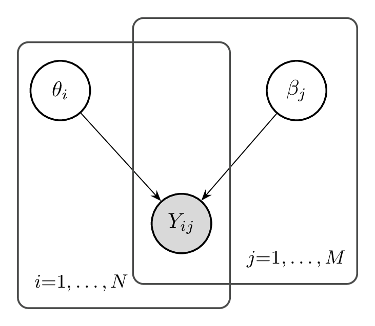

---
format:
  html:
    include-after-body:
      text: |
        <script>
        // Auto-execute all pyodide cells after initialization
        document.addEventListener('DOMContentLoaded', function() {
          // Wait for pyodide to be fully ready (mainPyodide is set after loading)
          function waitForPyodide() {
            if (typeof globalThis.mainPyodide !== 'undefined' && globalThis.mainPyodide) {
              // Pyodide is ready, execute all cells with autorun=true
              if (typeof globalThis.qpyodideCellDetails !== 'undefined') {
                globalThis.qpyodideCellDetails.forEach((cell, index) => {
                  if (cell.options && cell.options.autorun === 'true') {
                    setTimeout(() => {
                      const runButton = document.querySelector(`#qpyodide-button-run-${cell.id}`);
                      if (runButton && !runButton.disabled) {
                        runButton.click();
                      }
                    }, index * 1000); // Stagger execution by 1 second each
                  }
                });
              }
            } else {
              setTimeout(waitForPyodide, 500);
            }
          }
          setTimeout(waitForPyodide, 2000); // Start checking after 2 seconds
        });
        </script>
filters:
  - pyodide
pyodide:
  packages:
    - numpy
    - matplotlib
---

# Models {#sec-foundations}

::: {.callout-note title="Intended Learning Outcomes"}
By the end of this chapter, the reader will be able to:

1. **Distinguish** between Item Response Theory, factor models, paired comparison systems (Elo, Bradley-Terry), and network models (GGM, Ising).
2. **Explain** measurement as a homomorphism (representational measurement theory) and additive conjoint measurement, and map their elements onto the Rasch model.
3. **Explain** why the Rasch model holds a special status as "the measurement model" through the sufficiency of sum scores, specific objectivity, and test-free measurement.
4. **Explain** why observable response probabilities make the conjoint cancellation axioms empirically testable in AI evaluation, and state the caveats (link freedom, multidimensionality, sampling error, and the separation of measurement from validity).
5. **Derive** the sufficiency theorem for the Rasch model and explain its implications for AI benchmark evaluation.
6. **Compare** the prescriptive (Rasch school) and descriptive (general IRT) approaches to measurement and articulate when each is appropriate.
7. **Trace** the historical development from Thurstone (1927) through Rasch (1960) to modern network psychometrics.
8. **Connect** classical measurement concepts (reliability, validity, dimensionality) to contemporary AI benchmark evaluation.
9. **Apply** measurement theory to analyze whether AI benchmarks satisfy the requirements for scientific measurement.
10. **Implement** basic IRT models in Python and visualize item characteristic curves.
11. **Evaluate** the assumptions underlying AI leaderboards and identify potential violations of measurement principles.
:::

::: {.callout-important title="Scope of This Chapter"}
This chapter focuses on **model specification**: we introduce the probabilistic models used for measurement and explain what each one assumes. We do *not* cover how to estimate (learn) the parameters of these models---that is the subject of @sec-learning. Think of this chapter as defining the "what" (the models) and the next chapter as defining the "how" (the estimation).
:::

::: {.callout-tip title="Video Overview" collapse="false"}
A visual tour of the key concepts in this chapter — from response matrices and item characteristic curves to factor models and benchmark heterogeneity.


:::

::: {.callout-note title="Notation"}
This chapter introduces the core notation used throughout the book: $\theta_i$ (model ability), $\beta_j$ (item difficulty), $\boldsymbol{\beta}_j = (\beta_{j1}, \beta_{j2}, \beta_{j3})$ (the item-parameter vector collecting difficulty, discrimination, and guessing), $Y_{ij}$ (binary response), and $\sigma(\cdot)$ (logistic sigmoid). @sec-notation collects every symbol in one place---refer to it whenever a symbol is unfamiliar.
:::


@sec-validity drew the nomological network as a causal diagram: latent constructs $\theta$ that produce a system's responses $Y$, with the loading edges $\theta \to Y$ carrying the meaning we intend to measure. That chapter was conceptual---it said what a valid measurement *requires* (the construct exists and causally produces the responses) but left the edges as bare arrows, with no functional form and no way to recover $\theta$ from data. This chapter supplies the form. For the most part of this chapter, we will assume that we have already decided on a construct to be measured and a set of items to target that construct.

The goal is modest: assign each model a single number $\theta_i$ that represents its standing on one construct---an *ability*---on a *unidimensional* scale. The hard part is the word *represents*. Computing a model's accuracy already assigns it a number, but a number is not yet a measurement. A bathroom scale reading off body mass and a leaderboard reading off accuracy both produce numbers; only one is trusted to support arithmetic, comparison across instruments, and prediction. This section asks what separates the two---what it takes for "assign a number" to mean *measure*---and arrives at the model that, on one influential account, uniquely delivers it: the Rasch model. We build up in three steps: the general theory of when numbers measure (representational measurement theory, @sec-rmt); the specific structure that yields an interval scale for an attribute like ability, and the Rasch model that realizes it (additive conjoint measurement, @sec-acm); and the respect in which AI evaluation can *test* that structure rather than merely assume it (@sec-acm-ai).

## What Does It Mean to Measure? {#sec-rmt}

Representational measurement theory [@krantz1971foundations] makes precise what it means for numbers to measure. Its central idea: to measure is to construct a structure-preserving map---a *homomorphism*---from an **empirical relational structure** (the objects and the qualitative relations we can actually observe among them) into a **numerical relational structure** (the real numbers with their order and arithmetic).

Why should this be the *central* idea, rather than just "attach a number to each object"? Because the numbers we attach come with a great deal of built-in structure that we cannot help but use. As soon as a model has "ability 1.8" and another "ability 0.9", we are tempted to say the first is *twice* as able, or that the *gap* between them equals some other gap---statements that borrow the order, differences, and ratios of the real line. Those statements are only trustworthy if the objects genuinely stand in relations that mirror the numerical ones. The empirical relations come *first*: before any numbers, we can observe that this rod balances those two end to end, or that this model beats that one on item after item. A homomorphism is the promise that the numbers are a faithful stand-in for exactly those observations---order maps to order ($\ge$), physical combination maps to addition ($+$)---so that whatever we compute on the numbers can be read back as a true statement about the objects. Measurement, on this view, is not *imposing* a scale but *discovering* a numerical representation that the empirical structure already supports; the numbers are a model of reality the way a map is a model of terrain, trustworthy precisely because distances and directions on the map preserve those on the ground. Assigning numbers that do *not* preserve the structure (jersey numbers on athletes, area codes) is labeling, not measuring: arithmetic on them carries no information back to the world.

::: {.callout-note title="Definition: Measurement (representational)"}
An **empirical relational structure** $\mathcal{E} = \langle A, \succeq, \circ, \dots \rangle$ is a set of objects $A$ with observed relations---an order $\succeq$, perhaps a concatenation operation $\circ$. A **numerical relational structure** is $\mathcal{N} = \langle \mathbb{R}, \ge, +, \dots \rangle$. A **measurement** is a homomorphism $\phi: A \to \mathbb{R}$ preserving those relations:
$$
a \succeq b \iff \phi(a) \ge \phi(b), \qquad \phi(a \circ b) = \phi(a) + \phi(b).
$$
:::

Two theorems govern any such map.

A **representation theorem** has the form: *if* the empirical structure $\mathcal{E}$ satisfies a list of qualitative axioms, *then* a homomorphism $\phi$ into the reals exists (and the proof usually constructs one). The axioms are conditions stated entirely in terms of the observable relations---no numbers appear in them---and they are precisely the *empirical shadow* of the properties the number system already has. Real-number order is transitive and complete, so the empirical order $\succeq$ must be too: if $a \succeq b$ and $b \succeq c$ then $a \succeq c$. Real addition is associative and commutative, so if concatenation $\circ$ is to map to $+$, combining objects must be observably associative and commutative---$a \circ b$ must land at the same place on the scale as $b \circ a$. 

How rich a scale $\mathcal{E}$ supports depends on how many axioms it satisfies. The recurring ones are:

- **Weak order.** The relation $\succeq$ is *transitive* ($a \succeq b$ and $b \succeq c$ imply $a \succeq c$) and *complete* (every pair is comparable: $a \succeq b$ or $b \succeq a$). Informally: "rank everything, ties allowed."
- **Concatenation** ($\circ$). A way to combine two objects into a third---rods laid end to end, masses heaped on one pan---required to be *associative* ($(a \circ b) \circ c \sim a \circ (b \circ c)$) and *commutative* ($a \circ b \sim b \circ a$), mirroring the same properties of $+$.
- **Monotonicity.** Combining preserves order: $a \succeq b \iff a \circ c \succeq b \circ c$.
- **Archimedean.** No object is infinitely larger than another: enough copies of any object eventually exceed any other.
- **Density** (technical). A countable subset lies order-dense in $\succeq$; needed only to embed *infinite* object sets into $\mathbb{R}$, and automatic for finite benchmarks.

Which scale these buy:

- An **ordinal** scale follows from a weak order (plus density) alone: $\phi$ preserves order and nothing more, $a \succeq b \iff \phi(a) \ge \phi(b)$.
- A **ratio** scale follows from a weak order *together with* a concatenation operation satisfying associativity, commutativity, monotonicity, and the Archimedean condition; then $\phi$ also satisfies $\phi(a \circ b) = \phi(a) + \phi(b)$. The construction is essentially counting: fix a unit, lay down copies of it, and record how many balance the object---which is how length and mass are measured.
- An **interval** scale is the awkward middle: it needs additive structure but has *no* concatenation operation to supply it. The next section shows how *two conjoint factors* can play the role concatenation plays here (additive conjoint measurement, @sec-acm).

A **uniqueness theorem** then states how unique the resulting $\phi$ is---the class of admissible transformations carrying one valid homomorphism to another---and this fixes the **scale type**:

- **Ordinal:** any strictly increasing transformation is admissible; only the *order* of the numbers is meaningful.
- **Interval:** admissible transformations are positive affine, $\phi \mapsto a\phi + b$ with $a>0$; *differences* (and ratios of differences) are meaningful, but neither the zero nor the unit.
- **Ratio:** admissible transformations are $\phi \mapsto a\phi$; *ratios* are meaningful and there is a true zero.

These types form a hierarchy of increasing structure, each licensing more arithmetic than the last [@stevens1946theory]. (Below them sits the **nominal** scale---mere labels, like benchmark names or task categories, where only equality is meaningful.) An **ordinal** scale records only rank: medians and percentiles are meaningful, but the spacing between values is not, so a model that ranks first is *better* than the runner-up without being better *by any stated amount*---a raw leaderboard position is ordinal. An **interval** scale adds meaningful distances while keeping an arbitrary zero: differences and averages are licensed but ratios are not, the textbook case being temperature in degrees Celsius (the gap from $10°$ to $20°$ equals the gap from $20°$ to $30°$, yet $20°$ is not "twice as hot" as $10°$); an IRT ability $\theta$ on the logit scale is interval in just this sense, its zero a convention. A **ratio** scale adds a true zero, so ratios carry content and "twice as much" means something: length, mass, reaction time, and a raw *count* of items answered correctly are all ratio. The practical warning is that the scale type is fixed by the empirical structure, not by how the numbers look. An accuracy of $0.86$ is a perfectly good ratio-scale *count* of correct answers; but read as a measure of *ability* it is at best interval, and without a fitted model only ordinal---the decimals invite ratio and difference comparisons the construct may not support.

This gives "a meaningful numerical value" a precise sense: a numerical statement is **meaningful** exactly when its truth is invariant under the admissible transformations of the scale [@krantz1971foundations]. "Model A scored twice model B" is meaningful on a ratio scale, not an interval one; "the gap from A to B exceeds the gap from C to D" is meaningful on an interval scale, not an ordinal one. Scoring assigns numbers; measurement assigns numbers *and* certifies which statements about them survive rescaling.

Where do our objects of interest fall on this spectrum? Physical *extensive* quantities---length, mass, duration---come with a concatenation operation (lay rods end to end, pile masses on a balance), and that operation is what earns them a *ratio* scale; physical measurement sits at the rich end. Ability has no such operation: there is no way to concatenate two models', or two people's, abilities into a third. The most an ability scale can aspire to is therefore an *interval* scale, reachable only by the indirect, two-factor route of additive conjoint measurement (@sec-acm). Here human and AI measurement part ways. For human test-takers the conjoint axioms can only be *assumed*, because a response probability is never directly observed---each person meets each item essentially once---so interval status is a modeling commitment, and absent that commitment the defensible reading of a test score is merely *ordinal*. For AI systems the same axioms are *testable*: a model's response probability can be estimated by repeated sampling (@sec-acm-ai), so interval measurement can be earned from data rather than presumed. A leaderboard that only reports who outranked whom sits at the ordinal floor for both.

## Additive Conjoint Measurement {#sec-acm}

Classical extensive measurement (length, mass) earns its scale from a physical concatenation operation: lay rods end to end and length adds. Latent attributes have no such operation---there is no way to physically concatenate two models' abilities. Additive conjoint measurement [@luce1964simultaneous] is the branch of representational theory that recovers an interval scale for an attribute jointly determined by two **conjoint factors** from the order of their combined effect. (We call $A$ and $X$ *conjoint factors* to keep them distinct from the unrelated *factor model* of @sec-factor-models.) Let the conjoint factors be $A$ (models) and $X$ (items), and suppose we can observe, for each pair $(a,x) \in A \times X$, an ordering $\succeq$ by how much of the attribute results (how likely a correct response). Additive conjoint measurement asks when this order on the *product set* admits an additive representation.

::: {.callout-note title="Definition: Cancellation axioms"}
The order $\succeq$ on $A \times X$ satisfies:

- **Single cancellation (independence):** the order induced on $A$ by holding $x$ fixed does not depend on which $x$ is fixed, and symmetrically for $X$. So $(a_1, x) \succeq (a_2, x)$ for some $x$ implies $(a_1, x') \succeq (a_2, x')$ for every $x'$.
- **Double cancellation (the Thomsen condition):** for all $a_1, a_2, a_3 \in A$ and $x_1, x_2, x_3 \in X$,
$$
(a_1, x_2) \succeq (a_2, x_1) \;\text{ and }\; (a_2, x_3) \succeq (a_3, x_2) \;\Longrightarrow\; (a_1, x_3) \succeq (a_3, x_1).
$$
:::

Single cancellation implies parameter separation. Fixing an item $x$ induces a ranking of models, $a \succeq_x a' :\Leftrightarrow (a,x) \succeq (a',x)$; single cancellation says this ranking is the *same for every* $x$, so there is one item-independent order on models (and, symmetrically, one model-independent order on items). The conjoint factors decouple ---one can speak of "the stronger model" without naming an item. Equivalently, in the additive form the item's contribution is the same constant for both models and cancels: $f(a_1) + g(x) \ge f(a_2) + g(x) \iff f(a_1) \ge f(a_2)$, free of $x$. A model$\times$item *interaction*---a model strong on mathematics but weak on coding, outranking a rival on some items and trailing it on others---violates single cancellation outright. Double cancellation then forces the *spacings* of the two conjoint factors to agree, upgrading two separate orderings into one shared additive scale (the content made visible on the $3 \times 3$ grid below).

::: {.callout-note title="Definition: Solvability and the Archimedean condition"}
Two further *structural* conditions make the conjoint factors rich enough to carry a real-valued scale:

- **Restricted solvability:** the conjoint factors are finely graded---given a target cell, one can find a level of either factor that matches it, so intervals can always be bisected.
- **Archimedean:** no level is infinitely larger than another---enough equal steps along one factor eventually overtake any difference.

Unlike the cancellation axioms, these are not separately testable on coarse data; they are idealizations that guarantee the construction terminates in $\mathbb{R}$.
:::

::: {.callout-note title="Theorem: Additive representation"}
If $\succeq$ on $A \times X$ satisfies the cancellation, solvability, and Archimedean axioms, then there exist real functions $f: A \to \mathbb{R}$ and $g: X \to \mathbb{R}$ with
$$
(a,x) \succeq (a',x') \iff f(a) + g(x) \ge f(a') + g(x').
$$
$f$ and $g$ are unique up to a common positive affine transformation ($f \mapsto \alpha f + \beta_1$, $g \mapsto \alpha g + \beta_2$ with the same $\alpha > 0$). They are therefore **interval scales sharing a common unit.**
:::

::: {.callout-note title="Proof idea" collapse="true"}
Single cancellation lets each factor be ordered consistently on its own. Double cancellation is the binding constraint: it forces the *spacings* on $A$ and $X$ to be mutually consistent, so a unit defined on one factor transfers to the other. Restricted solvability supplies intermediate elements to bisect intervals; the Archimedean axiom guarantees the bisection terminates, pinning the scale to the reals. One builds a standard sequence of equally spaced elements and shows the additive representation is forced; common-unit interval uniqueness follows because only the shared unit and the two zeros are free. See @krantz1971foundations for the full construction.
:::

The content of double cancellation is easiest to see on a $3 \times 3$ grid: three models $a_1, a_2, a_3$ crossed with three items $x_1, x_2, x_3$. Each cell $(a_i, x_j)$ has an observed propensity (how likely model $i$ is to get item $j$ right), and *if* the structure is additive that propensity is ordered by $f(a_i) + g(x_j)$. Writing $f_i = f(a_i)$ and $g_j = g(x_j)$, the grid of additive values is:

|       | $x_1$       | $x_2$       | $x_3$       |
|:-----:|:-----------:|:-----------:|:-----------:|
| $a_1$ | $f_1 + g_1$ | $f_1 + g_2$ | $f_1 + g_3$ |
| $a_2$ | $f_2 + g_1$ | $f_2 + g_2$ | $f_2 + g_3$ |
| $a_3$ | $f_3 + g_1$ | $f_3 + g_2$ | $f_3 + g_3$ |

Now suppose we observe two comparisons across the off-diagonal cells: $(a_1, x_2) \succeq (a_2, x_1)$ and $(a_2, x_3) \succeq (a_3, x_2).$ Under the additive representation these read $f_1 + g_2 \ge f_2 + g_1$ and $f_2 + g_3 \ge f_3 + g_2$. Add the two inequalities and cancel the common terms $f_2$ and $g_2$ from both sides---the two cancellations that give the axiom its name---and what survives is $f_1 + g_3 \ge f_3 + g_1,$ or $(a_1, x_3) \succeq (a_3, x_1).$ So additivity forces the third comparison once the first two are seen: the two premises chain $a_1 \to a_2 \to a_3$ across the items, and the conclusion connects the endpoints. If a data set instead shows $(a_3, x_1) \succ (a_1, x_3)$, no functions $f, g$ whatsoever can reproduce it. The violation lives in the ordering of the cells, before any numbers are assigned---which is exactly what makes double cancellation an empirical claim rather than a modeling convenience.

Writing the additive structure inside a monotone link $\Phi$ that turns it into a probability gives
$$
P(Y_{ij} = 1) = \Phi(\theta_i - \beta_j).
$$
Taking $\Phi$ to be the logistic $\sigma(z) = 1/(1 + e^{-z})$ yields the Rasch model; taking the standard normal CDF yields the probit model. The additive structure makes the model a *measurement* model of $i$ (and $j$) -- the scale constructed is an interval scale. The monotone link re-expresses the same order as a probability.

In the Rasch model, parameter separation is also discussed as specific objectivity. The additive structure already made model comparisons item-free on the latent scale; the logistic link makes the cancellation in the observable odds,
$$
\frac{P(Y_{ij} = 1)/P(Y_{ij} = 0)}{P(Y_{kj} = 1)/P(Y_{kj} = 0)} = \exp(\theta_i - \theta_k),
$$
with the difficulty $\beta_j$ dropping out entirely. Operationally this is test-free comparison and subject-free calibration --- a model's ability can be estimated from any subset of calibrated items and an item's difficulty from any sample of models---which the sufficiency of @sec-rasch-measurement makes practical (items calibrate without knowing abilities, and conversely). It is what licenses comparing models across different set of items, building reusable item banks, adaptive testing (@sec-efficient), and equating benchmarks to a common scale---all contingent, as @sec-acm-ai stresses, on the Rasch model actually fitting the data.

## Sufficiency and Rasch Model {#sec-rasch-measurement}

In AI evaluation we almost always report a model's accuracy collapsing an entire response vector of a subject into a single number. When is that collapse harmless? Only if the detail we throw away--- which items were answered correctly, not merely how many---carries no further information about the model's ability. This is the sufficiency assumption, and reporting an average score is only justified if this assumption is valid. Here, we demonstrate that sufficiency assumption further specify the link function $\phi$ that is unspecified in ACM to be the logistic function $\sigma(\cdot)$. The resulting model is known as the Rasch model:

$$
P(Y_{ij} = 1 | \theta_i, \beta_j) = \sigma(\theta_i - \beta_j)
$$

Given the latent parameters $\theta_i$ and $\beta_j$, we assume that responses are conditionally independent. This is also referred to as local independence:

$$
P(Y_{i1}, \ldots, Y_{iM} \mid \theta_i, \beta) = \prod_{j=1}^M P(Y_{ij} \mid \theta_i, \beta_j).
$$

Local independence can be tested by residual correlations analysis between item pairs. Local independence can be violated in practice via shared context between items, where multiple items on the same reading passage, dataset split, or few-shot prompt template share information that $\theta_i$ does not model.

Below is the plate diagram of the Rasch model:

::: {.callout-tip title="Reading Plate Diagrams" collapse="false"}
Throughout this chapter we use **plate diagrams** to visualize probabilistic models, extending the graphical-model conventions of @sec-validity (open = latent, shaded = observed, arrows = dependence) with one new element---*plates* for replication. The full set of conventions:

- **Shaded (gray) nodes** represent *observed* variables (e.g., responses $Y_{ij}$).
- **Open (white) nodes** represent *latent* (unobserved) variables or parameters (e.g., ability $\theta_i$).
- **Arrows** indicate probabilistic dependencies: an arrow from $A$ to $B$ means $B$'s distribution depends on $A$.
- **Plates** (rectangles) indicate replication: a plate labeled "$i = 1, \ldots, N$" means the enclosed variables are repeated $N$ times, once per index $i$.

Nested plates represent crossed or hierarchical structure. For example, the response $Y_{ij}$ sits inside both the person plate ($i$) and the item plate ($j$), indicating one observation per person-item pair. For a comprehensive treatment of graphical models, see @koller2009pgm.
:::

{#fig-rasch-plate width=41%}

Next, we show that ACM and sufficiency assumption implies the Rasch model.

::: {.callout-note title="Theorem: Additivity + sufficiency imply Rasch"}
Take an additive latent-trait model in which each response depends on ability and difficulty only through their difference,
$$
P(Y_{ij} = 1 \mid \theta_i, \beta_j) = \Phi(\theta_i - \beta_j),
$$
for some strictly increasing link $\Phi$---the additive conjoint structure of @sec-acm, which leaves $\Phi$ free. If the raw sum score $S_i = \sum_{j=1}^M Y_{ij}$ is a sufficient statistic for $\theta_i$, then $\Phi$ must be logistic, so the model is the **Rasch model**. The converse also holds, so among additive models sum-score sufficiency *characterizes* Rasch [@andersen1973conditional; @fischer1995rasch]. Additive structure alone does not deliver sufficiency---the logistic link, singled out here, is what does. (Allowing items to differ in discrimination---the 2PL model---would make a discrimination-weighted score sufficient instead of the raw count.)
:::

::: {.callout-note title="Proof" collapse="true"}
Assume local independence, so the joint probability of a pattern $Y_i$ is $\prod_j \Phi(\theta_i - \beta_j)^{Y_{ij}}\,(1 - \Phi(\theta_i - \beta_j))^{1 - Y_{ij}}$, with log-likelihood
$$
\sum_j Y_{ij}\,\operatorname{logit}\Phi(\theta_i - \beta_j) \;+\; \sum_j \log\!\big(1 - \Phi(\theta_i - \beta_j)\big), \qquad \operatorname{logit}(p) = \log\tfrac{p}{1-p}.
$$
The second sum depends on $\theta_i$ but not on *which* items were correct, so it enters only the normalizer. By the factorization theorem, $S_i = \sum_j Y_{ij}$ is sufficient for $\theta_i$ exactly when $\theta_i$ enters the first sum *only through* $S_i$---that is, when $\operatorname{logit}\Phi(\theta_i - \beta_j)$ splits as $c\,\theta_i + d_j$ with the *same* slope $c$ for every item. A function of the single argument $\theta_i - \beta_j$ has that form only if $\operatorname{logit}\Phi$ is linear, i.e. $\Phi(z) = 1/(1 + e^{-cz})$; absorbing $c$ into the scale gives the logistic link---the Rasch model.

Conversely, in the Rasch model
$$
P(Y_i \mid \theta_i, \boldsymbol{\beta}) = \frac{\exp\!\big(\theta_i S_i - \sum_j Y_{ij}\beta_j\big)}{\prod_j \big(1 + \exp(\theta_i - \beta_j)\big)}
$$
factors as $g(S_i, \theta_i)\,h(Y_i, \boldsymbol{\beta})$, so $S_i$ is sufficient; and the $\exp(\theta_i S_i)$ factor cancels in $P(Y_i \mid S_i, \theta_i) = P(Y_i \mid \theta_i) / P(S_i \mid \theta_i)$, leaving the conditional pattern distribution free of $\theta$.
:::

The implication is that, before trusting average benchmark scores, we should test whether the Rasch model fits the data.

## Reinterpreting the Second Conjoint Factor {#sec-paired-comparison}

In some evaluation settings, we observe *pairwise comparisons*: which of two items is preferred, which of two players wins. The Bradley-Terry model (1952) is the foundational model for paired comparisons. As we will see, it is not a new model at all but the Rasch structure of @sec-acm with its **second conjoint factor reinterpreted**---the second slot holds not an item (carrying a difficulty) but a competitor (carrying a strength), drawn from the same pool as the first:

$$
P(i \succ j) = \sigma(\theta_i - \theta_j)
$$

where $i \succ j$ reads "$i$ is preferred to (beats) $j$" and $\theta_i, \theta_j$ are the "strength" or "quality" of competitors $i$ and $j$, both drawn from the same pool. Mathematically this *is* the Rasch model; only the reading of the second conjoint factor changes---instead of a subject answering an item, we have two subjects competing against each other.

{#fig-bt-plate width=41%}

The shared form with Rasch is not a coincidence of notation---it means the Bradley-Terry strength inherits the *interval* scale that additive conjoint measurement earns for Rasch ability (@sec-acm). Because the win probability depends only on the *difference* $\theta_i - \theta_j$ passed through a monotone link, it carries exactly the additive conjoint structure of @sec-acm, now with the two conjoint factors being the two *roles* of a comparison---the competitor in the first slot and the competitor in the second---so that the log-odds $\theta_i - \theta_j$ splits additively into a first-role contribution $f(i) = \theta_i$ and a second-role contribution $g(j) = -\theta_j$. Single cancellation holds: the ranking of first-slot competitors induced by any fixed opponent is the same opponent-independent order, because it depends on $\theta_i$ alone. Double cancellation holds because the structure is additive by construction. By the representation theorem (@sec-acm; @krantz1971foundations), the strengths $\theta$ therefore form an interval scale. Because the two roles range over the *same* set of competitors, this is the special "difference measurement" case of conjoint measurement [@krantz1971foundations], in which a single scale $\theta$ plays both conjoint factors at once.

The interval reading has teeth. *Differences* are meaningful---$\theta_i - \theta_j$ is precisely what fixes the win probability $\sigma(\theta_i - \theta_j)$---but there is no true zero, so *ratios* are not: a fixed rating gap means the same win probability wherever it sits on the scale, yet a competitor rated $1600$ is not "twice as strong" as one rated $800$. Only the origin is conventional (the logistic link pins the unit, exactly as in Rasch; Elo fixes the origin near $1500$). This is the paired-comparison counterpart of Rasch's specific objectivity: just as a model's Rasch ability can be estimated from any subset of items, a competitor's strength can be estimated from any schedule of opponents. And as with Rasch, AI evaluation can *test* this structure rather than assume it: repeated comparisons estimate each $P(i \succ j)$ directly, so additivity (double cancellation) can be checked on the array of win rates by the argument of @sec-acm-ai. When the check fails the diagnosis parallels the Rasch case: inconsistent *spacings* cost only the interval scale while leaving a consistent ranking, but *non-transitive* matchups---$A$ beats $B$, $B$ beats $C$, yet $C$ beats $A$, the paired-comparison signature of multidimensional or "rock--paper--scissors" capabilities---break even the ranking, signalling that no single strength number can order the field.

The Elo rating system, developed by Arpad Elo for chess ratings, is a Bradley-Terry model with online updates. After player $i$ with rating $R_i$ plays player $j$ with rating $R_j$, the ratings are updated: $R_i^{\text{new}} = R_i + K(y_i - E_i)$, where $Y_i \in \{0, 0.5, 1\}$ is the outcome (loss, draw, win), $E_i = \sigma((R_j - R_i)/400 \cdot \ln 10)$ is the expected outcome, and $K$ is a learning rate parameter. The Elo system is widely used in competitive games and has been adopted for AI evaluation in settings like the Chatbot Arena, where humans compare model outputs pairwise. The Chatbot Arena (LMSYS) uses Elo ratings to rank language models based on human preferences. When a user prefers model A's response over model B's, this is treated as a "win" for model A. The resulting ratings provide a preference-based complement to accuracy-based benchmarks.

## Testing for an Interval Scale {#sec-acm-ai}

In human testing, the response probability $p_{ij} = P(Y_{ij}=1)$ is unobservable. A person cannot be given the same item repeatedly under independent conditions---memory, learning, and fatigue destroy the independence---so only a single binary $Y_{ij}$ is ever seen, and $p_{ij}$ must be *inferred* through a model rather than measured. This is why the conjoint axioms of @sec-acm could only be assumed for human testing: the deterministic order on $A \times X$ that the axioms constrain was never directly observable. AI evaluation breaks this premise. A stateless model queried at sampling temperature $>0$ can be given the same item $T$ times with genuinely independent responses, so $\hat{p}_{ij} = \tfrac{1}{T}\sum_t Y_{ijt}$ estimates $p_{ij}$ *itself*, and $T$ can be made large. The observable object is then not a single bit but a real-valued array $[\hat{p}_{ij}]$ over the model$\times$item grid---exactly the conjoint structure the cancellation axioms describe. The deterministic-versus-probabilistic gap of @sec-acm narrows to a testable question:
$$
\text{additive conjoint structure holds} \iff \exists\ \text{monotone } \Phi:\ \Phi^{-1}(p_{ij}) \text{ is additive } (\theta_i + \delta_j),
$$
equivalently, the array $[p_{ij}]$ satisfies double cancellation. The Rasch model is the special case in which the additive scale is the logit. So in AI evaluation we can, for the first time, *test* whether ability and difficulty realize additive conjoint measurement instead of assuming it---by checking double cancellation directly, or by finding the monotone transform that minimizes departure from additivity and asking whether the residual interaction is within sampling error.

That phrase---"find the monotone transform that minimizes departure from additivity"---is, concretely, an **isotonic regression**, and naming it that way makes the whole test transparent. The Rasch model bundles two assumptions: the additive index $\theta_i - \beta_j$ and the logistic *shape* $\sigma$. A bad Rasch fit cannot tell you which one broke. To test additivity *alone*, keep the index and let the shape go free.

::: {.callout-note title="Definition: Nonparametric additive model (ADISOP)"}
$$
P(Y_{ij}=1 \mid \theta_i, \beta_j) = F(\theta_i - \beta_j),
$$
where $\theta_i$ (ability) and $\beta_j$ (difficulty) lie on a common scale and $F$ is a *single, unknown, non-decreasing* function---the link---estimated from the data rather than assumed. Every item is the same curve $F$ shifted by $\beta_j$, so the item characteristic curves are **parallel**; only their shared shape is free. Equivalently, this is a monotone *single-index* model: the entire $\text{model}\times\text{item}$ grid is summarized by one scalar index $s_{ij} = \theta_i - \beta_j$, and the response probability depends on the grid *only* through $s_{ij}$, monotonically. It is Scheiblechner's ADISOP [@scheiblechner1999additive]; the order-restricted conjoint tests of @karabatsos2001rasch ask the same question.
:::

Estimating $F$ *is* an isotonic regression. Hold the parameters fixed, place every cell's observed $\hat{p}_{ij}$ on the axis given by its index $s_{ij} = \theta_i - \beta_j$, and fit the non-decreasing step function that best matches them---the pool-adjacent-violators solution. Then update $\theta, \beta$ to sharpen the fit and iterate. Because the *only* freedom beyond the additive index is the monotone shape, this can reproduce $[\hat{p}_{ij}]$ **if and only if** the response probability really does depend on the grid through $\theta_i - \beta_j$ alone---which is double cancellation. What the isotonic fit *cannot* absorb is any dependence on the grid *beyond* the one-dimensional index: a genuine $\text{model}\times\text{item}$ interaction. So the **residual of the isotonic regression is the additivity test**, and it forks the Rasch ambiguity cleanly:

- **Small residual, but Rasch fit badly.** The data are additive; Rasch's misfit was the logistic *shape*, which the isotonic $F$ has now replaced. Additive conjoint measurement holds---the interval scale stands---you have merely *estimated* the link instead of assuming it, forgoing the sum-score sufficiency that was the logistic's private bonus (@sec-rasch-measurement).
- **Large residual even after the best isotonic $F$.** No monotone link makes the data additive; the dependence on the grid is genuinely two-dimensional, and additive conjoint measurement is rejected (what that costs, and how to localize it, is the next question).

One discipline keeps this honest. The isotonic $F$ is flexible---it will fit *at least* as well as Rasch---so a smaller residual alone proves nothing. The sharp comparison is against the model that breaks additivity with the *fewest* extra knobs: the 2PL, which adds one slope $a_j$ per item. On the logit scale the 2PL index is $a_j \theta_i - b_j$, whose slope varies by item; that item-specific stretching is exactly the dependence a single index $\theta_i - \beta_j$ cannot carry, and it makes the parallel curves cross. So if the parallel single-index fit already suffices, additivity holds; if you genuinely need per-item slopes, the unit of $\theta$ is item-dependent and additivity fails.

The model sits on a ladder of decreasing commitment, each rung an isotonic constraint loosened: Rasch (additive index $+$ logistic link) $\subset$ the nonparametric additive model (additive index $+$ isotonic link, still interval) $\subset$ the doubly-monotone model (non-crossing curves, ordinal specific objectivity) $\subset$ the monotone model. Each step right gives up an assumption and weakens the scale, interval to ordinal. In practice these isotonic models are measurement-theory tools with limited software; probit is the cheap parametric stand-in that keeps the additive index while only swapping the link.

What does *failing* mean? Only that no monotone $\Phi$ makes $[\hat{p}_{ij}]$ additive: the items admit no common interval scale on which a single ability orders every model. A failed test withdraws exactly one claim---that this item set measures *one* latent quantity, on these models, at the interval level---and it is a verdict on the *grid* tested (these items crossed with these models), not on the instrument in the abstract: a different population of models, or a unidimensional sub-domain of items, may still pass. Nor does it cost everything. If models rank the same way on every item but the *spacings* fail to align, one keeps a consistent *ordinal* ranking---accuracy still orders models, in the stochastic-ordering sense---and forfeits only the interval scale; the ranking itself breaks down only when models *reorder* across items.

These two cases are distinguished by their cause:

1. **Bad items.** Miskeyed, contaminated, or off-construct items create cancellation violations; removing them may restore additivity. This is the curation the diagnostics of @sec-rasch-measurement perform.
2. **Genuine multidimensionality.** A model strong at mathematics but weak at coding produces systematic interactions that *no* monotone transform removes. Here the failure is substantive: ability is not one quantity on this item set, and the honest response is to restrict the claim to a unidimensional sub-domain or adopt a multidimensional model (@sec-factor-models).

Three caveats keep the test honest. First, the link is free: passing double cancellation gives additive conjoint measurement, of which Rasch (logit) and probit are two coordinate systems---not Rasch specifically. Second, one observes $\hat{p}_{ij}$ with $O(1/\sqrt{T})$ error, so the deterministic axioms must be tested in their order-restricted, probabilistic form [@karabatsos2001rasch; @scheiblechner1995isotonic]; the remedy---raise $T$---is available in AI but not in human testing. Third, one can almost always *force* additivity by deleting enough items, even from noise, so a "pass" counts only if the curation was principled and additivity survives beyond chance.

Finally, passing the test certifies *quantitative structure*, not *validity*. An array can be perfectly additive in an attribute that is not the construct we intended---the scraped-coding benchmark of @sec-validity has additive structure in *memorization*, not coding ability. Additive conjoint measurement answers "is this a quantity, and may I do interval arithmetic on it?"; it does not answer "is it the quantity I claim?" That second license is construct validity, and it must be earned separately.

The additive structure leaves a visible fingerprint. Take a real response matrix $Y$ (@sec-response-matrix): 50 models from the Open LLM Leaderboard, each scored on the same 100-item sample, with entry $1$ for a correct answer and $0$ otherwise. The raw matrix looks unstructured, but sorting its rows and columns by their totals exposes the conjoint order.



```{pyodide-python}
#| label: response-matrix-visualization
#| autorun: true
#| fig-cap: "A real response matrix: 50 models from the Open LLM Leaderboard scored on a 100-item sample. Rows are sorted by model accuracy, columns by item proportion-correct. The near-triangular gradient is the empirical signature of an additive ability--difficulty structure ordering both models and items."

import json
from pyodide.http import open_url

# Real 50-model x 100-item slice of the Open LLM Leaderboard (binary scored).
# Loaded from a precomputed resource shipped with the book.
raw = json.loads(open_url("data/openllm_subset.json").read())
Y = np.array(raw["data"], dtype=float)

# Sort models (rows) and items (columns) by their totals
row_order = np.argsort(Y.sum(axis=1))[::-1]
col_order = np.argsort(Y.sum(axis=0))[::-1]
Y_sorted = Y[row_order][:, col_order]

fig, ax = plt.subplots(1, 1)
ax.imshow(Y_sorted, aspect='auto', cmap='Blues', interpolation='nearest')
ax.set_xlabel('Items (sorted by proportion correct)')
ax.set_ylabel('Models (sorted by accuracy)')
ax.set_title('Open LLM Leaderboard: sorted response matrix (50 × 100)')

plt.show()
```

In the sorted matrix the correct answers concentrate toward one corner and thin out toward the opposite---a near-triangular gradient rather than a uniform scatter. This is the conjoint order made visible: models range from those that succeed on nearly every item to those that succeed only on the easiest, items range from those nearly every model solves to those almost none do, and a single additive $\theta_i - \beta_j$ orders the whole grid. The gradient need not appear---multidimensional or noisy data wash it out---which is precisely the point: additivity is a property the data can fail to have.

A caution about the word "realization." The Rasch model is the *probabilistic analogue* of additive conjoint measurement [@brogden1977rasch; @perline1979rasch], not a deduction from its axioms. The cancellation axioms describe a deterministic order on $A \times X$; the Rasch model specifies probabilities. Bridging the two---reading a deterministic conjoint structure off stochastic responses---is exactly the contested step [@michell2008pathological; @kyngdon2008rasch]. The additivity lives in the model's parameters, not, without further work, demonstrably in the world. The next two sections close this gap from both sides: the statistical characterization that makes the structure *internal* to the model (@sec-rasch-measurement), and the feature of AI evaluation that makes the conjoint axioms *empirically testable* (@sec-acm-ai).

::: {.callout-tip title="Application: Using Sufficiency to Find Benchmark Bugs"}
@truong2025bugs turn the sufficiency property into a practical diagnostic tool. Their argument: if the AI evaluation community reports mean scores as the primary metric, it is *implicitly assuming* that the sum score is a sufficient statistic for ability --- which, by the theorem above, implies the Rasch model is the data-generating process. Under the Rasch model, two testable consequences follow:

1. **Positive tetrachoric correlations.** All inter-item tetrachoric correlations must be non-negative (Corollary of Chebyshev's inequality applied to increasing functions of the same latent variable $\theta$).
2. **Positive item-total correlations.** Each item must correlate positively with the total score.

Items that violate these conditions --- negative tetrachoric correlations, negative item-total correlations, or low Mokken scalability coefficients --- are flagged as potentially invalid. Applying this to nine benchmarks including GSM8K and MMLU, @truong2025bugs achieve up to 84% precision at the top-50 flagged items: of the 50 most suspicious questions, up to 42 were confirmed invalid by human experts. Common errors include ambiguous wording, incorrect answer keys (e.g., treating exponential depreciation as linear), grading bugs (e.g., "\$7.00" $\neq$ "7"), and culturally-embedded assumptions.

This illustrates a broader principle: the mathematical properties of measurement models are not merely theoretical --- they yield *operational* diagnostics for evaluation quality. When data violate model predictions, either the model is wrong or the data are corrupted. Since the sufficiency assumption is already implicit in how the community uses benchmarks, violations are strong evidence of item-level problems.
:::


To see the diagnostic in action, plant eight defective items in a simulated Rasch benchmark---four with flipped answer keys, four answered at random---and rank every item by its **item--total correlation** (its correlation with the rest of the test). Sound items show the *positive manifold*; the defects fall to the bottom.

```{pyodide-python}
#| label: item-bug-diagnostic
#| autorun: true
#| fig-cap: "Item--total correlation for every item in a simulated benchmark with eight planted defects (red): flipped-key items correlate negatively, random items sit near zero, and sound items (blue) sit well above. Ranking by this correlation flags the defects---the @truong2025bugs diagnostic in miniature."
import numpy as np
import matplotlib.pyplot as plt

def sigmoid(x):
    return np.where(x >= 0, 1 / (1 + np.exp(-x)), np.exp(x) / (1 + np.exp(x)))

rng = np.random.RandomState(0)
N, M, n_bad = 200, 60, 8
theta = rng.normal(0, 1, N)
beta  = rng.normal(0, 1, M)
Y = (rng.rand(N, M) < sigmoid(theta[:, None] - beta[None, :])).astype(float)

bad = rng.choice(M, n_bad, replace=False)
for idx, j in enumerate(bad):
    if idx < n_bad // 2:
        Y[:, j] = 1 - Y[:, j]                        # flipped answer key
    else:
        Y[:, j] = (rng.rand(N) < 0.5).astype(float)  # random responses (no signal)

total = Y.sum(1)
itc = np.array([np.corrcoef(Y[:, j], total - Y[:, j])[0, 1] for j in range(M)])  # leave-one-out
is_bad = np.zeros(M, bool); is_bad[bad] = True

order   = np.argsort(itc)
flagged = order[:n_bad]
precision = np.mean(is_bad[flagged])

plt.figure(figsize=(3.6, 2.2))
plt.scatter(range(M), itc[order],
            c=['#d62728' if is_bad[i] else '#1f77b4' for i in order], s=12)
plt.axhline(0, color='black', lw=0.8)
plt.xlabel('item (ranked by item--total correlation)')
plt.ylabel('item--total correlation')
plt.title('Broken items have low correlation'); plt.grid(True, alpha=0.3)
plt.tight_layout(); plt.show()
print(f"precision@{n_bad} (flag the lowest-correlation items) = {precision:.2f}")
```

The defective items fall to the bottom, and flagging the lowest-correlation items recovers all eight. In practice the flagged items should be *inspected* rather than deleted blindly, since a low correlation can also mark a genuinely multidimensional skill rather than an error.

## The $n$-Parameter Logistic Model {#sec-irt}
Sometimes, the data does not fit the Rasch model, even for the isotonic version. In that case, we cannot license an interval scale, but we can still construct a useful ordinal scale with a more statistically expressive class of models. The $n$-parameter logistic model is such a class of model. The $n$-parameter logistic model equips each item with a parameter vector $\boldsymbol{\beta}_j = [\beta_{j1}, \ldots, \beta_{jn}] \in \mathbb{R}^n$, letting items differ along more than one axis. Rasch is the case $n=1$; the cases $n=2$ and $n=3$ below add a discrimination and a guessing component, respectively. Because every variant still attaches a single parameter object to each item, the plate diagram is structurally identical to the Rasch model (@fig-rasch-plate)---the lone item node $\beta_j$ now standing for the full vector $\boldsymbol{\beta}_j$ rather than a scalar difficulty.

The two-parameter logistic model gives item $j$ a discrimination $\beta_{j2}$ alongside its difficulty $\beta_{j1}$:

$$
P(Y_{ij} = 1 | \theta_i, \boldsymbol{\beta}_j) = \sigma(\beta_{j2}(\theta_i - \beta_{j1}))
$$
Items with higher discrimination are better at distinguishing between persons of different abilities. Their ICCs are steeper, meaning small changes in ability produce large changes in response probability.

The per-item discrimination has a precise consequence for the *scale type* of the ability estimate. In the 2PL model, $\operatorname{logit} P(Y_{ij}=1) = \beta_{j2}(\theta_i - \beta_{j1})$, so the log-odds gap between two models on item $j$ is $\beta_{j2}(\theta_i - \theta_k)$. Its *sign* is the same on every item (discriminations are positive), so models keep a consistent ordering---single cancellation, the ordinal separation of @sec-acm, survives. But its *magnitude* is scaled by the item's discrimination $\beta_{j2}$: each item converts $\theta$-differences into log-odds at its own rate, so the *unit* of $\theta$ is item-dependent. Double cancellation fails, no additive representation exists, and $\theta$ is therefore **not a fundamental (additive conjoint) interval scale**. It is identified only up to a positive affine transformation---one fixes its origin and unit by convention, typically $\theta \sim \mathcal{N}(0,1)$---so it is *interval by parametric stipulation*, not because the data carry an item-independent unit. Rasch is exactly the case $\beta_{j2} \equiv 1$: one common exchange rate, an item-independent unit, a genuine interval scale. This sharpens both camps. The prescriptive claim becomes precise---only Rasch earns the interval scale from structure, while the 2PL borrows it from the assumed logistic--Gaussian form. So does the descriptive reply: an affine-identified $\theta$ that fits the data is interval enough for ranking and selection, and discarding items to force $\beta_{j2} \equiv 1$ throws away real information about which items discriminate.

For multiple-choice tests, even low-ability test-takers may answer correctly by guessing. The **three-parameter logistic model** adds a lower asymptote, a guessing parameter $\beta_{j3}$, so $\boldsymbol{\beta}_j = (\beta_{j1}, \beta_{j2}, \beta_{j3})$:

$$
P(Y_{ij} = 1 | \theta_i, \boldsymbol{\beta}_j) = \beta_{j3} + (1 - \beta_{j3}) \sigma(\beta_{j2}(\theta_i - \beta_{j1}))
$$

where $\beta_{j3} \in [0, 1]$ is the guessing (or pseudo-chance) parameter. For a 4-option multiple-choice item, we might expect $\beta_{j3} \approx 0.25$ if low-ability test-takers guess randomly.


```{pyodide-python}
#| label: icc-models
#| autorun: true
#| fig-cap: "Item characteristic curves (ICCs) across the logistic IRT models---each curve gives the probability of a correct response as a function of ability for a fixed item. Left: Rasch (1PL) at several difficulties, the same curve shifted in location. Middle: 2PL at a common difficulty but different discriminations, where a steeper slope distinguishes ability levels more sharply. Right: 1PL, 2PL, and 3PL compared, the 3PL adding a non-zero lower asymptote for guessing."

import numpy as np
import matplotlib.pyplot as plt

def sigmoid(x):
    return 1 / (1 + np.exp(-x))

theta = np.linspace(-4, 4, 200)

fig, axes = plt.subplots(1, 3, figsize=(6, 2), sharey=True)
legend_kw = dict(loc='upper left', fontsize=6, framealpha=0.9,
                 borderpad=0.2, labelspacing=0.2, handlelength=1.2, handletextpad=0.4)

# Left panel: Rasch (1PL), varying difficulty
for beta in [-2, -1, 0, 1, 2]:
    axes[0].plot(theta, sigmoid(theta - beta), label=f'$\\beta = {beta}$', linewidth=1.5)
axes[0].axhline(y=0.5, color='gray', linestyle='--', alpha=0.5)
axes[0].set_xlabel('Ability ($\\theta$)', fontsize=8)
axes[0].set_ylabel('$P(Y = 1)$', fontsize=8)
axes[0].set_title('1PL: effect of difficulty', fontsize=9)
axes[0].legend(title='Difficulty', title_fontsize=6, **legend_kw)
axes[0].tick_params(labelsize=7)
axes[0].grid(True, alpha=0.3)

# Middle panel: 2PL, common difficulty, varying discrimination (y-axis shared)
beta = 0
for a in [0.5, 1.0, 1.5, 2.0]:
    axes[1].plot(theta, sigmoid(a * (theta - beta)), label=f'$a = {a}$', linewidth=1.5)
axes[1].axhline(y=0.5, color='gray', linestyle='--', alpha=0.5)
axes[1].axvline(x=0, color='gray', linestyle='--', alpha=0.5)
axes[1].set_xlabel('Ability ($\\theta$)', fontsize=8)
axes[1].set_title('2PL: effect of discrimination', fontsize=9)
axes[1].legend(title='Discrimination', title_fontsize=6, **legend_kw)
axes[1].tick_params(labelsize=7)
axes[1].grid(True, alpha=0.3)

# Right panel: 1PL vs 2PL vs 3PL at a fixed difficulty (y-axis shared)
a, beta, c = 1.5, 0, 0.25
axes[2].plot(theta, sigmoid(theta - beta), label='1PL (Rasch)', linewidth=1.5)
axes[2].plot(theta, sigmoid(a * (theta - beta)), label='2PL', linewidth=1.5)
axes[2].plot(theta, c + (1 - c) * sigmoid(a * (theta - beta)), label='3PL', linewidth=1.5)
axes[2].axhline(y=0.5, color='gray', linestyle='--', alpha=0.3)
axes[2].axhline(y=c, color='gray', linestyle=':', alpha=0.5, label=f'Guessing = {c}')
axes[2].set_xlabel('Ability ($\\theta$)', fontsize=8)
axes[2].set_title('1PL vs 2PL vs 3PL', fontsize=9)
axes[2].legend(**legend_kw)
axes[2].tick_params(labelsize=7)
axes[2].grid(True, alpha=0.3)

plt.tight_layout()
plt.show()
```

## Exercises {#sec-irt-exercises}

**Exercise 1.1** (*): Explain why the sum score is a sufficient statistic in the Rasch model but not in the 2PL model. What information is lost when we reduce responses to sum scores under 2PL?

**Exercise 1.2** (**): Prove that the Bradley-Terry model is equivalent to a Rasch model where each "person" is a comparison between two items.

*Hint:* Consider a "person" as an ordered pair $(i, j)$ representing a comparison, and an "item" as a single entity $k$ appearing in a comparison. Define appropriate ability and difficulty parameters.

**Exercise 1.3** (**): Show that in the Rasch model, the odds ratio for persons $i$ and $k$ responding correctly to item $j$ is:

$$
\frac{P(Y_{ij} = 1) / P(Y_{ij} = 0)}{P(Y_{kj} = 1) / P(Y_{kj} = 0)} = \exp(\theta_i - \theta_k)
$$

independent of the item difficulty $\beta_j$. Explain why this property is called "specific objectivity."

**Exercise 1.4** (***): The Ising model and the Rasch model make different assumptions about why responses correlate.

(a) Write down both models for binary data $Y \in \{0, 1\}^{N \times M}$.

(b) Describe the causal structure each model assumes.

(c) Under what conditions might each model be appropriate for AI evaluation?

(d) Propose an empirical test that could distinguish between them.

**Exercise 1.5** (**): Implement Rasch model estimation using conditional maximum likelihood.

```python
# Given: Response matrix Y (N models x M questions)
# Task: Estimate item difficulties using conditional MLE
#
# Steps:
# 1. Compute sum scores for each model
# 2. For each item, compute the conditional likelihood given sum scores
# 3. Optimize to find item difficulties
# 4. Compare estimated difficulties to empirical item means (proportion correct)
#
# Use scipy.optimize.minimize for optimization

import numpy as np
from scipy.optimize import minimize
from scipy.special import logsumexp

def estimate_rasch_conditional(Y):
    """
    Estimate Rasch model item difficulties using conditional MLE.

    Parameters:
    -----------
    Y : np.ndarray, shape (N, M)
        Binary response matrix

    Returns:
    --------
    beta : np.ndarray, shape (M,)
        Estimated item difficulties (identified by setting sum(beta) = 0)
    """
    N, M = Y.shape
    # CODE HERE
    pass

# Test on simulated data
np.random.seed(42)
N, M = 100, 50
theta_true = np.random.normal(0, 1, N)
beta_true = np.random.normal(0, 1, M)
prob = 1 / (1 + np.exp(-(theta_true[:, None] - beta_true[None, :])))
Y = (np.random.random((N, M)) < prob).astype(int)

beta_hat = estimate_rasch_conditional(Y)
# Compare to true values (after centering)
```

**Exercise 1.6** (**): Given pairwise preference data, estimate Bradley-Terry parameters.

```python
# Given: Comparison data as list of (winner, loser) pairs
# Task: Estimate strength parameters via maximum likelihood
#
# The likelihood for comparison (i beats j) is:
# P(i > j) = exp(theta_i) / (exp(theta_i) + exp(theta_j))
#           = sigmoid(theta_i - theta_j)

import numpy as np
from scipy.optimize import minimize

def estimate_bradley_terry(comparisons, n_items):
    """
    Estimate Bradley-Terry model parameters.

    Parameters:
    -----------
    comparisons : list of (int, int)
        List of (winner, loser) pairs
    n_items : int
        Number of items

    Returns:
    --------
    theta : np.ndarray, shape (n_items,)
        Estimated strength parameters (identified by setting theta[0] = 0)
    """
    # CODE HERE
    pass

# Test: Simulate comparisons and recover parameters
```

**Exercise 1.7** (***): Test whether benchmark data fit the Rasch model using Andersen's likelihood ratio test.

```python
# Andersen's LR test:
# 1. Split persons into groups based on sum score (e.g., high vs low scorers)
# 2. Estimate item difficulties separately for each group
# 3. If Rasch holds, these estimates should be equal
# 4. Test statistic: 2 * (sum of group log-likelihoods - pooled log-likelihood)
# 5. Under H0, this is chi-squared with df = (n_groups - 1) * (n_items - 1)

def andersen_lr_test(Y, n_groups=2):
    """
    Perform Andersen's LR test for Rasch model fit.

    Parameters:
    -----------
    Y : np.ndarray, shape (N, M)
        Binary response matrix
    n_groups : int
        Number of groups to split persons into

    Returns:
    --------
    statistic : float
        LR test statistic
    p_value : float
        p-value from chi-squared distribution
    """
    # CODE HERE
    pass
```

**Exercise 1.8** (***): Implement the benchmark item-bug diagnostic of @truong2025bugs.

```python
# Simulate a Rasch benchmark with planted defective items, then rank items by
# three scalability diagnostics and measure how well each recovers the defects.
#
# Steps:
# 1. Simulate Y (N = 80 models x M = 200 items) from a Rasch model.
# 2. Plant 20 buggy items: 10 with flipped keys, 10 answered at random.
# 3. Rank items by (a) item-total correlation, (b) average tetrachoric
#    correlation, and (c) Mokken H_j (@eq-mokken-h).
# 4. Report precision@20 and recall@20 for each ranking.
# 5. Repeat as the model pool grows from N = 10 to N = 100 and plot how
#    detection quality scales with the number of test-takers.

import numpy as np

def detect_buggy_items(N, M, n_bad, seed=0):
    """Return precision@n_bad and recall@n_bad for each of the three diagnostics."""
    # CODE HERE
    pass
```

**Discussion 1.1:** The Rasch model's sufficiency property justifies using sum scores as measurements. But most AI benchmarks use items with varying discriminations, which violates the Rasch assumption. Does this mean that current benchmark rankings are fundamentally flawed, or can they still be useful approximations? Under what conditions would adopting Rasch-based measurement change the ranking of frontier models?

**Discussion 1.2:** The Rasch school argues that items not fitting the Rasch model should be discarded because they do not measure the same construct. What are the implications of this view for AI benchmark design? Should we design benchmarks to fit Rasch, or should we use more flexible models that accommodate heterogeneous items?

**Discussion 1.3:** Network psychometrics views symptoms as causally connected rather than caused by a latent factor. Could AI capabilities be "network-like" rather than "factor-like"? What evidence would distinguish these views? How would it change how we interpret benchmark scores?

**Discussion 1.4:** @truong2025irsl show that IRT ability $\theta$ scales linearly with $\log(\text{FLOP})$ during pre-training, and that this relationship enables cross-benchmark transfer of ability estimates. What does this imply about the nature of the latent construct $\theta$? Is it a stable property of the model, or an artifact of the IRT parameterization? Under what conditions would cross-benchmark transfer of $\theta$ fail?


## Bibliographic Notes {#sec-irt-bib}

The probabilistic models we use today emerged from over a century of work across psychology, education, economics, and statistics. Understanding this history illuminates why certain models dominate and what problems they were designed to solve.

The story begins with L.L. Thurstone at the University of Chicago. In 1927, Thurstone proposed a model for how people make pairwise comparisons: the Law of Comparative Judgment [@thurstone]. Thurstone's insight was that subjective quantities (preferences, attitudes, perceived stimuli) could be placed on a numerical scale by analyzing patterns of pairwise comparisons. If we ask many people whether stimulus A is greater than stimulus B, and record the proportion who say yes, we can infer the underlying scale values. Acording to Thurstone's model, each stimulus $i$ has a true scale value $\theta_i$. When comparing stimuli $i$ and $j$, each is perceived with Gaussian noise: $\tilde{\theta}_i \sim \mathcal{N}(\theta_i, \sigma^2), \quad \tilde{\theta}_j \sim \mathcal{N}(\theta_j, \sigma^2)$. The probability that $i$ is judged greater than $j$ is:

$$
P(i \succ j) = \Phi\left(\frac{\theta_i - \theta_j}{\sqrt{2}\sigma}\right)
$$

where $\Phi$ is the standard normal CDF. Thurstone's method showed that subjective quantities could be measured scientifically. The same mathematics now underlies how we rank AI systems from human preferences.

In 1952, Ralph Bradley and Milton Terry developed a model for ranking from paired comparisons in the context of incomplete block designs [@bradley-terry-model]. Their model:

$$
P(i \succ j) = \frac{\pi_i}{\pi_i + \pi_j}
$$

where $\pi_i > 0$ are "worth" parameters. With $\theta_i = \log \pi_i$, this becomes the familiar logistic form. In 1959, R. Duncan Luce provided an axiomatic foundation through Choice Axiom: the ratio of choice probabilities for two alternatives should be independent of what other alternatives are available. This axiom leads directly to the Bradley-Terry/logistic model.

In 1960, Danish mathematician Georg Rasch published "Probabilistic Models for Some Intelligence and Attainment Tests," which introduced what we now call the Rasch model [@rasch1960probabilistic]. Rasch's contribution was the philosophical framework of specific objectivity: the requirement that person and item parameters must be separable. Rasch's work was introduced to the United States by Benjamin Wright at the University of Chicago, who heard Rasch lecture in 1960. Wright became the leading advocate for Rasch measurement in the English-speaking world, founding the MESA (Measurement, Evaluation, Statistical Analysis) program and the journal Rasch Measurement Transactions.

The view of measurement as a homomorphism from an empirical relational structure onto the numbers is *representational measurement theory*, given its canonical treatment in Krantz, Luce, Suppes, and Tversky's Foundations of Measurement [@krantz1971foundations]; @stevens1946theory provides the older scale-typology (nominal/ordinal/interval/ratio) that it refines. Additive conjoint measurement originates with Luce and Tukey's "Simultaneous Conjoint Measurement" [@luce1964simultaneous], which showed that the cancellation axioms on an ordered two-factor structure suffice to construct interval scales without a prior unit. That the Rasch model realizes this structure was argued by @brogden1977rasch and @perline1979rasch. The inference is contested: @michell2008pathological and @kyngdon2008rasch dispute whether reading a *deterministic* conjoint order off *stochastic* responses is licensed, a debate the chapter treats as open. The order-restricted, probabilistic formulations that make the axioms empirically testable---rather than assumed---are developed in @karabatsos2001rasch and @scheiblechner1995isotonic; these are the tools behind this chapter's claim that AI evaluation, by resampling at temperature $>0$, can *test* additive conjoint structure where human testing could only posit it.

In the 2010s, these methods reached AI evaluation---the application of IRT to benchmark analysis [@polo2024tinybenchmarks], multidimensional factor models for AI capabilities (this textbook), and the Chatbot Arena's use of Elo ratings to rank language models [@chiang2024chatbotarena].
