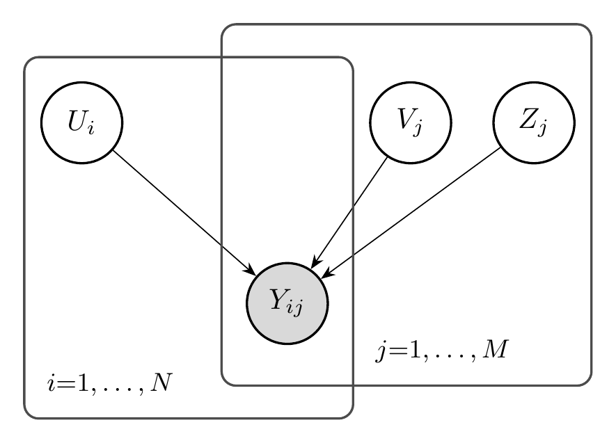

---
format:
  html:
    include-after-body:
      text: |
        <script>
        // Auto-execute all pyodide cells after initialization
        document.addEventListener('DOMContentLoaded', function() {
          function waitForPyodide() {
            if (typeof globalThis.mainPyodide !== 'undefined' && globalThis.mainPyodide) {
              if (typeof globalThis.qpyodideCellDetails !== 'undefined') {
                globalThis.qpyodideCellDetails.forEach((cell, index) => {
                  if (cell.options && cell.options.autorun === 'true') {
                    setTimeout(() => {
                      const runButton = document.querySelector(`#qpyodide-button-run-${cell.id}`);
                      if (runButton && !runButton.disabled) {
                        runButton.click();
                      }
                    }, index * 1000);
                  }
                });
              }
            } else {
              setTimeout(waitForPyodide, 500);
            }
          }
          setTimeout(waitForPyodide, 2000);
        });
        </script>
filters:
  - pyodide
pyodide:
  packages:
    - numpy
    - matplotlib
---

# Discovery {#sec-discovery}

::: {.callout-note title="Intended Learning Outcomes"}
By the end of this chapter, the reader will be able to:

1. **Distinguish** the *confirmatory* setting of @sec-foundations through @sec-reliability (a construct is posited and the question is whether items measure it) from the *exploratory* setting of this chapter (only a collection of items is given and the construct structure must be discovered).
2. **Determine** how many constructs an item set measures using parallel analysis, distinguishing genuine factors from the eigenvalues that sampling noise alone produces.
3. **Compute** and interpret the structure matrix of a fitted factor model, and explain why standardized loadings---not raw loadings---are the comparable fingerprint of an item.
4. **Cluster** items by their structure vectors to reveal latent subgroups, and diagnose benchmark heterogeneity from the resulting inter-cluster correlations.
5. **Evaluate** the generalization of a learned factor model under masking schemes (entry-wise, row holdout, column holdout), distinguishing interpolation from extrapolation to unseen models and items.
6. **Contrast** the common-cause (latent-variable) account of item correlations with the network account, in which correlations arise from direct associations among items rather than a shared latent factor.
7. **Specify** the Gaussian graphical model (partial-correlation network) and the Ising model as the continuous and binary network models, and relate each to its estimation procedure.
8. **Explain** why latent-variable and network structures can be observationally close, connecting this underdetermination to the nomological equivalence of @sec-validity.
:::

::: {.callout-important title="Scope of This Chapter"}
The preceding chapters all begin from a *named construct*. @sec-validity asks whether an instrument measures the construct it claims to; @sec-foundations builds models that assume a single ability $\theta$ and tests whether items realize it; @sec-learning estimates those models; @sec-reliability quantifies how precisely they measure. Throughout, *the thing being measured is decided in advance*, and the work is to certify that the items deliver it.

This chapter takes the opposite starting point. We are handed a collection of items---a benchmark, or a merge of several---*without* a vetted account of what they measure, and we ask the data to tell us: **How many distinct things does this item set measure? Which items measure which? And is "one ability" even the right shape for the dependence among items, or are the items related directly, with no common cause behind them?** This is the *exploratory* or *discovery* mode of measurement, the analogue of exploratory (as opposed to confirmatory) factor analysis in psychometrics. The factor model of @sec-factor-models supplies the first tool; network models supply the second.
:::

::: {.callout-note title="Notation"}
This chapter's central object is the factor model (@sec-factor-models): $U_i \in \mathbb{R}^K$ (person factor vector), $V_j \in \mathbb{R}^K$ (item loading vector), $Z_j$ (item intercept), and $\Sigma = \operatorname{Cov}(U)$ (factor covariance). New beyond it are the **structure matrix** $S$, the per-item **structure vector** $S_j$, and the network quantities: the precision matrix $\Theta = \Sigma^{-1}$, partial correlations $\rho_{jk\cdot\text{rest}}$, and the Ising couplings $\omega_{jk}$.
:::

The instrument for most of this chapter is the **factor model**, developed in @sec-factor-models below. Where the IRT models of @sec-foundations give each model a single ability $\theta_i$ and ask whether the items realize it, the factor model gives a *vector* and lets the data say how many axes there are (@sec-dimensionality), which items load on which (@sec-structure-matrix), and how those items group into latent skills (@sec-item-clustering). Its role as the multidimensional escape hatch was flagged in @sec-acm-ai; here we put it to systematic exploratory use. The final section then asks whether a latent-axis picture is the right one at all, or whether the items are better described as a network with no common cause behind them (@sec-network-models).

## How Many Constructs? Dimensionality Assessment {#sec-dimensionality}

The first and bluntest discovery question is *how many* distinct things an item set measures. In the confirmatory setting of @sec-foundations one assumes the answer is one---a single ability $\theta$---and tests whether the items realize it; here we let the data decide the count. The primary tool is **eigenvalue analysis** of the item correlation matrix: a unidimensional set has one eigenvalue far larger than the rest, while $k$ genuine constructs produce $k$ large eigenvalues. But raw eigenvalues mislead, because even pure noise produces a first eigenvalue above one (sampling fluctuations inflate the leading principal component of any finite matrix).

**Parallel analysis** [@horn1965rationale] corrects for this by comparing the observed eigenvalues against those from *random* data of the same dimensions, retaining a factor only when its eigenvalue exceeds the random-data threshold. The count $k$ it returns is the number of factors we carry into the structure matrix of @sec-structure-matrix and the clustering of @sec-item-clustering---the rest of this chapter takes that count as given.

```{pyodide-python}
#| label: dimensionality-analysis
#| autorun: true
import numpy as np
import matplotlib.pyplot as plt

np.random.seed(123)

# --- Simulate a 2-factor benchmark ---
n_models = 300
n_items = 20
n_factor1 = 10  # "verbal reasoning" items
n_factor2 = 10  # "quantitative reasoning" items

# Two latent factors with moderate correlation
factor_corr = 0.3
cov_matrix = np.array([[1.0, factor_corr], [factor_corr, 1.0]])
L = np.linalg.cholesky(cov_matrix)
factors = np.random.normal(0, 1, (n_models, 2)) @ L.T

# Factor loadings
loadings = np.zeros((n_items, 2))
loadings[:n_factor1, 0] = np.random.uniform(0.5, 0.9, n_factor1)  # Factor 1
loadings[n_factor1:, 1] = np.random.uniform(0.5, 0.9, n_factor2)  # Factor 2

# Generate continuous item scores (for eigenvalue analysis)
noise_var = 0.4
X = factors @ loadings.T + np.random.normal(0, np.sqrt(noise_var), (n_models, n_items))

# --- Eigenvalue analysis ---
corr_matrix = np.corrcoef(X.T)
eigenvalues = np.linalg.eigvalsh(corr_matrix)[::-1]  # Descending

# --- Parallel analysis (100 replications) ---
n_reps = 100
random_eigenvalues = np.zeros((n_reps, n_items))
for rep in range(n_reps):
    X_random = np.random.normal(0, 1, (n_models, n_items))
    corr_random = np.corrcoef(X_random.T)
    random_eigenvalues[rep] = np.linalg.eigvalsh(corr_random)[::-1]

pa_threshold = np.percentile(random_eigenvalues, 95, axis=0)

# --- Visualization ---
fig, axes = plt.subplots(1, 2, figsize=(6, 2))

# Panel 1: Scree plot with parallel analysis
components = np.arange(1, n_items + 1)
axes[0].plot(components[:10], eigenvalues[:10], 'o-', color='#5B8DEE', linewidth=2,
             markersize=8, label='Observed eigenvalues', zorder=3)
axes[0].plot(components[:10], pa_threshold[:10], 's--', color='#E8637A', linewidth=2,
             markersize=6, label='95th percentile (random)', zorder=3)
axes[0].axhline(y=1, color='gray', linewidth=0.8, linestyle=':', label='Kaiser criterion')
# Shade retained factors
n_retained = sum(eigenvalues > pa_threshold)
for k in range(min(n_retained, 10)):
    axes[0].axvspan(k + 0.6, k + 1.4, alpha=0.1, color='#45BF7C')
axes[0].set_xlabel('Component')
axes[0].set_ylabel('Eigenvalue')
axes[0].set_title('Scree Plot with Parallel Analysis')
axes[0].legend()
axes[0].set_xticks(components[:10])

# Panel 2: Loading structure
# Estimate loadings via PCA (first 2 components)
X_centered = X - X.mean(axis=0)
U, S, Vt = np.linalg.svd(X_centered, full_matrices=False)
pc_loadings = Vt[:2, :].T * S[:2] / np.sqrt(n_models - 1)

colors = ['#5B8DEE'] * n_factor1 + ['#E8637A'] * n_factor2
axes[1].scatter(pc_loadings[:, 0], pc_loadings[:, 1], c=colors, s=80,
                edgecolors='white', linewidth=0.5, zorder=3)
for i in range(n_items):
    axes[1].annotate(f'{i+1}', (pc_loadings[i, 0] + 0.02, pc_loadings[i, 1] + 0.02),
                     fontsize=7, color='gray')
axes[1].axhline(y=0, color='gray', linewidth=0.5)
axes[1].axvline(x=0, color='gray', linewidth=0.5)
axes[1].set_xlabel('PC1 Loading (Factor 1: Verbal)')
axes[1].set_ylabel('PC2 Loading (Factor 2: Quantitative)')
axes[1].set_title('Item Loading Structure')
from matplotlib.patches import Patch
axes[1].legend(handles=[
    Patch(facecolor='#5B8DEE', label='Verbal items (1-10)'),
    Patch(facecolor='#E8637A', label='Quantitative items (11-20)')
])

plt.tight_layout()
plt.show()

print(f"\nDimensionality Assessment:")
print(f"  First 5 eigenvalues: {', '.join(f'{e:.2f}' for e in eigenvalues[:5])}")
print(f"  Parallel analysis threshold: {', '.join(f'{e:.2f}' for e in pa_threshold[:5])}")
print(f"  Factors retained (parallel analysis): {n_retained}")
print(f"  Variance explained by 2 factors: {eigenvalues[:2].sum() / eigenvalues.sum():.1%}")
```

The scree plot (left) shows two eigenvalues clearly exceeding the parallel-analysis threshold (red dashed line), confirming two-dimensional structure. The loading plot (right) reveals the two-factor structure: verbal items (blue, 1--10) load on the first component, while quantitative items (red, 11--20) load on the second. A benchmark reporting a single "reasoning" score would conflate these two distinct abilities.

This count is the input to everything that follows. When parallel analysis returns $k = 1$, the unidimensional models of @sec-foundations are licensed and a single composite score is defensible; when $k > 1$, the honest response to a benchmark sold as one score is to report subscores per factor or revise the item set toward a single construct---and to fit a $k$-factor model (@sec-factor-models) whose loadings reveal *which* items measure *which* of the $k$ constructs (@sec-structure-matrix).

## The Factor Model {#sec-factor-models}

The instrument that turns a construct *count* into a *characterization* is the **factor model**. Where the IRT models of @sec-foundations assign each model a single ability $\theta_i$, the factor model assigns a *vector*, letting each item load on more than one latent axis---exactly what a count $k > 1$ calls for.

Factor models provide an alternative perspective on latent variable measurement. While IRT focuses on item-level response probabilities, factor models focus on the covariance structure of responses. The classical linear factor model assumes observed variables are linear combinations of latent factors plus noise:

$$
X_j = \lambda_{j1} F_1 + \lambda_{j2} F_2 + \cdots + \lambda_{jK} F_K + \epsilon_j
$$

where:

- $X_j$ is the observed score on item $j$
- $F_k$ are latent factors (abilities, traits)
- $\lambda_{jk}$ are factor loadings
- $\epsilon_j$ is item-specific error

In matrix notation: $X = \Lambda F + \epsilon$, where $\Lambda$ is the $M \times K$ matrix of factor loadings. For binary data, we use a logistic link function:

$$
P(Y_{ij} = 1 | U_i, V_j, Z_j) = \sigma(U_i^\top V_j + Z_j)
$$

where $U_i \in \mathbb{R}^K$ is the latent factor vector for person $i$, $V_j \in \mathbb{R}^K$ is the factor loading vector for item $j$, and $Z_j \in \mathbb{R}$ is the item intercept.

The key difference is the link function: the linear model uses an identity link ($X_j = \ldots$) for continuous responses, while the logistic model passes the linear predictor through the sigmoid $\sigma(\cdot)$ to produce a probability for binary responses.

{#fig-factor-plate width=50%}

When $K = 1$ and $V_j = 1$ for all $j$, the logistic factor model reduces to the Rasch model of @sec-foundations: the multidimensional version simply lets each item carry its own loading *vector* rather than a fixed unit loading.

### Fitting the Factor Model {#sec-logistic-fm}

We estimate the parameters $(U, V, Z)$ by minimizing the binary cross-entropy between the predicted probabilities and the observed responses---the same maximum-likelihood objective developed for the Rasch model in @sec-learning, now over matrix-valued parameters. A compact implementation:

```{python}
#| eval: false

import torch
import torch.nn as nn
from torch.optim import LBFGS
import torch.nn.functional as F

class LogisticFM(nn.Module):
    """Logistic Factor Model for binary response data."""
    def __init__(self, N, M, K):
        super().__init__()
        self.U = nn.Parameter(torch.randn(N, K))  # Model abilities
        self.V = nn.Parameter(torch.randn(M, K))  # Item loadings
        self.Z = nn.Parameter(torch.randn(M, 1))  # Item intercepts

    def forward(self):
        return torch.sigmoid(self.U @ self.V.T + self.Z.T)
```

::: {.callout-note title="Interpretation"}
- $U_i$: latent ability vector of model $i$ (position in $K$-dimensional capability space)
- $V_j$: latent property vector of item $j$ (which capabilities the item measures)
- $Z_j$: overall item difficulty (independent of capability dimensions)
- $\sigma$: sigmoid function ensuring probabilities in $[0,1]$
:::

We train by minimizing binary cross-entropy loss with L-BFGS:

```{python}
#| eval: false

# Training setup
N, M = Y.shape
K = 2  # Number of latent dimensions
model = LogisticFM(N, M, K)

opt = LBFGS(
    model.parameters(),
    lr=0.1,
    max_iter=20,
    history_size=10,
    line_search_fn="strong_wolfe"
)

def closure():
    opt.zero_grad()
    probs = model()
    loss = F.binary_cross_entropy(probs[train_mask], Y[train_mask].float())
    loss.backward()
    return loss

# Training loop
for iteration in range(20):
    loss = opt.step(closure)
```

The model learns to decompose the response matrix into latent factors that capture the underlying structure of model capabilities and item characteristics. With a fitted model in hand, the next sections read its parameters---the loadings $V_j$ via the structure matrix, and their groupings via clustering---and @sec-generalization asks how well those parameters predict held-out models and items.

## Reading What Each Item Measures: The Structure Matrix {#sec-structure-matrix}

After fitting a multidimensional factor model, we obtain estimated item loadings $\hat{V}_j$ that describe how each item relates to the latent factors. However, raw factor loadings require standardization for interpretable comparisons across items and benchmarks.

The **structure matrix** $S$ captures the correlation between each item's latent response and each factor:

::: {.callout-note title="Definition: Structure Matrix"}
For a logistic factor model, the latent response $Y^*_{ij}$ can be written as $Y^*_{ij} = U_i^\top V_j + Z_j + \epsilon_{ij}$, where $\epsilon_{ij}$ follows a logistic distribution with variance $\pi^2/3$. The structure matrix entry $S_{jk}$ is the correlation between item $j$'s latent response and factor $k$:

$$
S_{jk} = \text{Cor}(Y^*_{ij}, U_{ik}) = \frac{(V_j^\top \Sigma)_k}{\sqrt{\Sigma_{kk}} \sqrt{V_j^\top \Sigma V_j + \pi^2/3}}
$$

where $\Sigma = \text{Cov}(U)$ is the factor covariance matrix.
:::

The formula for $S_{jk}$ is just a Pearson correlation, built from the standard recipe

$$
\text{Cor}(A, B) = \frac{\text{Cov}(A, B)}{\text{SD}(A) \cdot \text{SD}(B)},
$$

applied to $A = Y^*_{ij}$ and $B = U_{ik}$. Reading the three pieces in turn:

- **Numerator — the covariance.** Of the three terms in $Y^*_{ij} = U_i^\top V_j + Z_j + \epsilon_{ij}$, only $U_i^\top V_j$ depends on $U$; the item difficulty $Z_j$ and logistic noise $\epsilon_{ij}$ are independent of $U$ and drop out. This leaves
$$
\text{Cov}(Y^*_{ij}, U_{ik}) = \text{Cov}(U_i^\top V_j,\, U_{ik}) = (V_j^\top \Sigma)_k.
$$

- **Denominator — the two standard deviations.** The factor has $\text{SD}(U_{ik}) = \sqrt{\Sigma_{kk}}$, and the latent response has
$$
\text{SD}(Y^*_{ij}) = \sqrt{\underbrace{V_j^\top \Sigma V_j}_{\text{from } U_i^\top V_j} + \underbrace{\pi^2/3}_{\text{from } \epsilon_{ij}}},
$$
since $Z_j$ is a constant offset and the logistic error contributes variance $\pi^2/3$.

- **Why standardize.** The resulting $S_{jk} \in [-1, 1]$ is directly comparable across items, unlike the raw loadings $V_j$, which depend on the arbitrary scale of the factors.

A detailed derivation is given in @sec-learning.

We define the **structure vector** for item $j$ as $S_j = (S_{j1}, S_{j2}, \ldots, S_{jK})^\top \in \mathbb{R}^K$, where each entry $S_{jk}$ is given by the formula above. Stacking these row vectors yields the $M \times K$ **structure matrix** $S$, whose $j$-th row is $S_j^\top$. The structure vector $S_j$ serves as a standardized fingerprint of item $j$: it tells us how strongly the item's latent response correlates with each factor, on a $[-1, 1]$ scale that is comparable across items.

The structure matrix has several important properties:

1. **Bounded values:** Each entry $S_{jk} \in [-1, 1]$, making comparisons intuitive.
2. **Interpretability:** High positive values indicate the item strongly measures that factor; negative values indicate inverse relationships.
3. **Clustering:** Items with similar structure vectors measure similar constructs and can be grouped together.

For AI benchmarks, the structure matrix reveals which questions tap into which capabilities. Two questions may both be "correct/incorrect" but load on different factors---one measuring reasoning, another measuring factual recall. This has important implications for how we interpret aggregate benchmark scores.

## Item Clustering and Benchmark Heterogeneity {#sec-item-clustering}

With the structure matrix in hand, we can cluster items into latent subgroups using standard clustering algorithms such as Gaussian Mixture Models (GMM). Each cluster represents a group of items sharing similar factor loadings---analogous to "skills" or "themes" within the benchmark. This approach is analogous to exploratory factor analysis in psychometrics, revealing whether benchmarks are essentially unidimensional or composed of multiple, potentially antagonistic, latent skills.

::: {.callout-important title="Benchmark Heterogeneity"}
A key insight from factor analysis applied to AI benchmarks is that **benchmarks are rarely homogeneous**. Intentionally or not, they often combine items that test different capabilities, and even a single benchmark item may test a combination of capabilities.

Two models with identical mean scores may excel on different capability dimensions. For example, one model might be strong in reasoning but weak in factual recall, while another may have the reverse profile. When item clusters show weak or negative correlations with each other, the benchmark-level mean score becomes neither informative nor accurate about subgroup performance.
:::

Within each benchmark, we can quantify inter-construct correlations by:

1. **Clustering items** based on their structure vectors using GMM with BIC for model selection
2. **Computing cluster means** for each model (average accuracy on items in each cluster)
3. **Correlating cluster means** across models to assess construct overlap

Strongly positive inter-cluster correlations indicate overlapping constructs, while weak or negative correlations suggest distinct and possibly conflicting capabilities being aggregated by the benchmark's mean score. This multidimensional pattern explains why two models with identical overall accuracies may excel on entirely different skill axes.

Factor models assign a feature vector to each item (the structure vector), allowing items to be clustered via standard algorithms. This helps interpret evaluation results that would otherwise be obscured by aggregate scores.

## Generalization of the Factor Model {#sec-generalization}

Fitting the factor model (@sec-factor-models) yields learned parameters $(U, V, Z)$, and the previous two sections read structure out of them. But a discovered structure is only useful if it *generalizes*: do the learned parameters predict responses the model never trained on? To evaluate the robustness and transferability of learned factor models, we train and test them under various **masking schemes**, each representing a different notion of generalization. These masks determine which parts of the response matrix $Y$ are visible during training and which are held out for evaluation.

### Masking Schemes for Evaluation {#sec-masking-schemes}

| **Masking Type** | **Train Set** | **Test Set** | **Purpose** |
|------------------|---------------|--------------|-------------|
| Entry-wise random | 80% random entries | 20% random entries | Interpolation under missing-at-random |
| Row holdout (random) | 80% of models, all items | 20% of models, all items | Generalization to unseen models |
| Row holdout (shifted) | Slice of models (small→large) | Disjoint slice | Covariate-shift generalization |
| Column holdout (random) | All models, 80% of items | All models, 20% of items | Generalization to unseen items |
| Column holdout (shifted) | Subset of benchmarks | Held-out benchmarks | Cross-domain transfer |
| Row-column block (L-mask) | $R_{tr} \times C_{tr}$ | $R_{te} \times C_{te}$ | Compositional generalization |
| Temporal split | Models before cutoff | Models after cutoff | Temporal generalization |

These settings parallel psychometric validation tests where new examinees, items, or contexts probe the invariance of latent constructs.

### Implementation of Masking Functions

```{python}
#| eval: false

import torch

def random_mask(data_idtor, pct=0.8):
    """Entry-wise random masking."""
    train_idtor = torch.bernoulli(data_idtor * pct).int()
    test_idtor = data_idtor.int() - train_idtor
    return train_idtor, test_idtor

def model_mask(data_idtor, pct_models=0.8, exposure_rate=0.3):
    """Row holdout: hold out unseen models."""
    train_row_mask = torch.bernoulli(torch.ones(data_idtor.shape[0]) * pct_models).bool()
    train_idtor = torch.zeros_like(data_idtor).int()
    train_idtor[train_row_mask, :] = data_idtor[train_row_mask, :]
    train_idtor[~train_row_mask, :], _ = random_mask(data_idtor[~train_row_mask, :], pct=exposure_rate)
    test_idtor = data_idtor - train_idtor
    return train_idtor, test_idtor

def item_mask(data_idtor, pct_items=0.8, exposure_rate=0.3):
    """Column holdout: hold out unseen items."""
    train_col_mask = torch.bernoulli(torch.ones(data_idtor.shape[1]) * pct_items).bool()
    train_idtor = torch.zeros_like(data_idtor).int()
    train_idtor[:, train_col_mask] = data_idtor[:, train_col_mask]
    train_idtor[:, ~train_col_mask], _ = random_mask(data_idtor[:, ~train_col_mask], pct=exposure_rate)
    test_idtor = data_idtor - train_idtor
    return train_idtor, test_idtor

def L_mask(data_idtor, pct_models=0.8, pct_items=0.8):
    """Row-column block (L-mask): compositional generalization."""
    train_row_mask = torch.bernoulli(torch.ones(data_idtor.shape[0]) * pct_models).bool()
    train_col_mask = torch.bernoulli(torch.ones(data_idtor.shape[1]) * pct_items).bool()
    train_idtor = torch.zeros_like(data_idtor).int()
    train_idtor[train_row_mask][:, train_col_mask] = data_idtor[train_row_mask][:, train_col_mask]
    test_idtor = data_idtor - train_idtor
    test_idtor[train_row_mask, :] = 0
    test_idtor[:, train_col_mask] = 0
    return train_idtor, test_idtor
```

### Two-Stage Training for Holdout Generalization {#sec-two-stage}

To avoid data contamination in row and column holdout experiments, we use a **two-stage training procedure**:

#### Row Holdout: Estimating Parameters for Unseen Models

When testing generalization to unseen models, we:

1. **Stage 1:** Train on known models to learn item parameters $(V, Z)$
2. **Stage 2:** Freeze $(V, Z)$ and estimate ability parameters $U$ for held-out models using their limited exposed responses

This ensures item parameters are learned without information from test models.

```{python}
#| eval: false

# Stage 1: Train on known models
test_row = test_idtor.max(axis=1).values  # Identify held-out models
model_stage1 = train_model(Y[~test_row, :], mask=train_idtor[~test_row, :])

# Freeze V, Z from Stage 1
V_frozen = model_stage1.V.detach()
Z_frozen = model_stage1.Z.detach()

# Stage 2: Estimate U for unseen models with frozen item parameters
model_stage2 = train_model(Y[test_row, :], mask=train_idtor[test_row, :],
                           V_fixed=V_frozen, Z_fixed=Z_frozen)
```

#### Column Holdout: Estimating Parameters for Unseen Items

When testing generalization to unseen items, we:

1. **Stage 1:** Train on known items to learn model parameters $U$
2. **Stage 2:** Freeze $U$ and estimate item parameters $(V, Z)$ for held-out items

```{python}
#| eval: false

# Stage 1: Train on known items
test_col = test_idtor.max(axis=0).values  # Identify held-out items
model_stage1 = train_model(Y[:, ~test_col], mask=train_idtor[:, ~test_col])

# Freeze U from Stage 1
U_frozen = model_stage1.U.detach()

# Stage 2: Estimate V, Z for unseen items with frozen model parameters
model_stage2 = train_model(Y[:, test_col], mask=train_idtor[:, test_col],
                           U_fixed=U_frozen)
```

::: {.callout-note title="Why Two-Stage Training?"}
The two-stage procedure prevents information leakage:

- **Row holdout:** Item parameters learned from training models should not contain information about test models
- **Column holdout:** Model parameters learned from training items should not contain information about test items

This mirrors the real-world scenario where we want to evaluate new models on pre-calibrated items, or calibrate new items using established models.
:::

### Evaluation Across Masking Schemes

For each masking scheme, we compute AUC on the held-out entries:

```{python}
#| eval: false

from torchmetrics import AUROC

masking_schemes = {
    "entry_random": random_mask,
    "row_holdout": model_mask,
    "col_holdout": item_mask,
    "L_mask": L_mask,
}

results = {}
auroc = AUROC(task="binary")

for name, mask_fn in masking_schemes.items():
    train_mask, test_mask = mask_fn(data_idtor)

    # Train model (with two-stage for row/col holdout)
    model = train_with_appropriate_stages(Y, train_mask, test_mask, name)

    # Evaluate on held-out entries
    P_hat = model().detach()
    auc = auroc(P_hat[test_mask.bool()], Y[test_mask.bool()])
    results[name] = auc.item()
    print(f"{name}: AUC = {auc:.3f}")
```

The factor model typically achieves AUC of 92-97% on random masking across benchmarks, demonstrating strong predictive power. Performance on row and column holdout tests the model's ability to generalize to new models and new items, respectively.

::: {.callout-tip title="Application: Item Response Scaling Laws"}
The separability of model ability from item difficulty — the core property of IRT — has a powerful application to scaling laws. @truong2025irsl show that by embedding IRT within the scaling law framework, one can factorize scaling law estimation from $O(M \times N)$ to $O(M + N)$, where $M$ is the number of models (or checkpoints) and $N$ is the number of questions.

Their key finding is that the IRT ability parameter $\theta$ scales linearly with the logarithm of pre-training compute: $\theta \approx a \cdot \log(\text{FLOP}) + b$. Combined with calibrated item parameters, this yields per-question scaling predictions: $\hat{R}_{ij}(x) = \sigma(d_j(\theta_i(x) - z_j))$. Because item parameters transfer across benchmarks that share the same measurement objective, ability estimated on one benchmark can predict performance on another — a direct validation of the cross-benchmark transfer tested in the masking experiments above.

In a study of 6,612 model checkpoints and 37,682 questions, this approach achieves comparable or superior decision accuracy to traditional scaling laws using only 50 questions per benchmark — a 99.9% reduction in queries. The approach uses Beta-IRT, which models empirical probability responses (token probabilities, pass rates) rather than binary correctness, capturing richer scaling signals.
:::

## When There Is No Common Cause: Network Models {#sec-network-models}

The factor model, for all its flexibility, still rests on one structural commitment inherited from @sec-validity: a small set of latent variables is the *common cause* of every response, and items correlate *because* they share those causes. Hold the factors fixed and the items become independent---this is the local-independence assumption of @sec-rasch-measurement, drawn as arrows fanning *out* from $\theta$ (or $U$) to the responses. Discovery in the previous two sections stayed inside this picture: it asked only *how many* common causes there are and *which* items they touch.

Network psychometrics questions the picture itself. Suppose the items correlate not because a hidden ability radiates into all of them, but because they are *directly* coupled to one another---mastering the subskill behind item $A$ is itself what makes item $B$ solvable, with no third thing behind both. Then there is no construct to measure, only a web of mutual dependence to map. The object of discovery becomes the **graph** of direct associations: which items are connected, and how strongly, once every other item is accounted for.

The two accounts make a sharp, testable distinction at the level of *partial* (rather than marginal) association. Under a single latent factor, any two items are correlated marginally but become **conditionally independent given the factor**---the common cause explains away their association. Under a network, two coupled items stay associated *even after conditioning on every other item*, because their link is direct. So the discovery question is: conditioning on all other items, which associations survive?

### The Gaussian graphical model {#sec-ggm}

For continuous responses (or a latent-Gaussian surrogate for binary ones), the natural object is the **Gaussian graphical model** (GGM): a partial-correlation network. Let the items have covariance $\Sigma$ and **precision matrix** $\Theta = \Sigma^{-1}$. The partial correlation between items $j$ and $k$, controlling for all other items, is read directly off the precision matrix:

$$
\rho_{jk\cdot\text{rest}} = -\frac{\Theta_{jk}}{\sqrt{\Theta_{jj}\,\Theta_{kk}}}.
$$

The defining fact is that **a zero in the precision matrix is a conditional independence**: $\Theta_{jk} = 0 \iff$ items $j$ and $k$ are independent given all the others $\iff$ no edge $j\!-\!k$ in the network. The marginal correlation matrix $\Sigma$ is typically dense---everything correlates with everything through shared paths---but $\Theta$ can be sparse, and that sparsity *is* the network. Because a finite sample never yields exact zeros, one estimates a sparse $\hat\Theta$ directly with an $\ell_1$ penalty (the **graphical lasso** [@friedman2008glasso]), which sets small partial correlations to zero and returns an interpretable graph.

The contrast with the factor model is exact and worth stating as a slogan: the factor model explains a dense $\Sigma$ by a *low-rank* structure ($V\Sigma V^\top$ plus diagonal noise); the network explains the same $\Sigma$ by a *sparse inverse*. Low rank and sparse inverse are different hypotheses about *why* items covary, and the partial-correlation graph is what separates them.

### The Ising model {#sec-ising}

For binary responses $Y \in \{0,1\}^M$---the usual benchmark case---the network analogue of the GGM is the **Ising model**, a pairwise Markov random field:

$$
P(Y = y) = \frac{1}{Z(\tau,\omega)}\,\exp\!\Big(\sum_{j} \tau_j\, y_j + \sum_{j<k} \omega_{jk}\, y_j y_k\Big),
$$

where $\tau_j$ is a threshold (an item's baseline propensity to be solved) and $\omega_{jk}$ is the **coupling** between items $j$ and $k$---the direct association that remains after conditioning on every other item. As with the GGM, $\omega_{jk}=0$ means no edge, and $Z(\tau,\omega)$ is the normalizing constant. Estimating the full joint is intractable for many items, but the conditional of each item given the rest is exactly a logistic regression on the other items,
$$
P(Y_j = 1 \mid Y_{-j}) = \sigma\!\Big(\tau_j + \sum_{k \ne j}\omega_{jk}\,y_k\Big),
$$
so the network can be recovered **node by node** with $\ell_1$-penalized logistic regressions and the edge weights symmetrized---the *eLasso* / `IsingFit` procedure [@vandeborkulo2014ising]. This is the binary counterpart of the graphical lasso, and it is the model Exercise 4 of @sec-foundations pits against the Rasch model.

::: {.callout-note title="Definition: Nodewise neighborhood selection"}
For each item $j$, regress $Y_j$ on all other items $Y_{-j}$ with an $\ell_1$ penalty; the nonzero coefficients identify $j$'s **neighborhood** (its candidate edges). Doing this for every node and combining the results (an edge is kept if one or both endpoints select it) recovers the graph without ever forming the intractable joint likelihood. The same recipe estimates a GGM (linear regressions) or an Ising model (logistic regressions).
:::

### Networks and latent factors can look alike {#sec-network-equivalence}

It is tempting to read a sparse network as proof that "there is no latent ability." The inference is not that clean. Marginalizing a latent variable out of a local-independence model produces a *fully connected* network among the observed items---the common cause reappears as dense, uniform coupling [@marsman2018ising]. Conversely, an Ising model whose coupling matrix has one dominant eigenvalue mimics a unidimensional latent factor: its summed score behaves almost exactly like a Rasch ability. The two stories therefore sit at opposite ends of a single family, and over a moderate sample they can be observationally close.

This is the same underdetermination we met in @sec-validity, where a correlated-factors model and a bifactor model reproduced the *same* observable covariance (@fig-nomological-equiv): the data fix the correlations, not the diagram behind them. Discovery, honestly practiced, returns a *menu* of structures compatible with the responses---one latent axis, several correlated axes, a sparse interaction network---and the choice among them is made by parsimony, out-of-sample prediction (@sec-learning), and substantive knowledge of the items, not by fit alone. What discovery *does* settle is the negative claim: when the partial-correlation graph refuses to collapse to a low-rank common cause, a single benchmark score is measuring a web, not a quantity.

The demonstration below makes the GGM-versus-correlation distinction concrete on the same Open LLM Leaderboard slice used in @sec-acm-ai. The marginal correlations among items are dense; their partial correlations---the precision-matrix view---are far sparser, and that gap is exactly the structure a network model reads as *direct* item-to-item dependence.



```{pyodide-python}
#| label: partial-correlation-network
#| autorun: true
#| fig-cap: "Marginal vs. partial item correlations on a 30-item slice of the Open LLM Leaderboard. Left: the marginal correlation matrix is dense---almost every pair of items is positively correlated, the signature of a shared latent ability. Right: the partial correlations (from the inverse covariance) are far sparser; most marginal association is explained away by conditioning on the other items, and only a few direct item-to-item links survive. Sparsity in the right panel, not density in the left, is what a network model treats as structure."

import json
import numpy as np
import matplotlib.pyplot as plt
from pyodide.http import open_url

raw = json.loads(open_url("data/openllm_subset.json").read())
Y = np.array(raw["data"], dtype=float)

# Keep the 30 items with the most balanced solve rates (informative, non-degenerate).
p = Y.mean(axis=0)
keep = np.argsort(np.abs(p - 0.5))[:30]
Yc = Y[:, keep]

# Marginal correlation matrix.
C = np.corrcoef(Yc, rowvar=False)

# Partial correlations from the (regularized) precision matrix.
S = np.cov(Yc, rowvar=False) + 1e-2 * np.eye(Yc.shape[1])  # ridge for invertibility
Theta = np.linalg.inv(S)
d = np.sqrt(np.diag(Theta))
P = -Theta / np.outer(d, d)        # partial correlations
np.fill_diagonal(P, 1.0)

fig, axes = plt.subplots(1, 2, figsize=(6.4, 3.0))
for ax, M, title in [(axes[0], C, "Marginal correlation"),
                     (axes[1], P, "Partial correlation")]:
    im = ax.imshow(M, vmin=-0.6, vmax=0.6, cmap="RdBu_r")
    ax.set_title(title, fontsize=9)
    ax.set_xticks([]); ax.set_yticks([])
fig.colorbar(im, ax=axes, fraction=0.046, pad=0.04)
plt.show()

frac = lambda M: np.mean(np.abs(M[np.triu_indices_from(M, 1)]) > 0.1)
print(f"off-diagonal |corr| > 0.1 : marginal = {frac(C):.2f}, partial = {frac(P):.2f}")
```

The marginal panel is the dense positive manifold a common-cause model predicts; the partial panel keeps only the associations that survive conditioning on everything else. When that residual graph is sparse, a low-rank latent model is the parsimonious explanation. When it stays dense and irreducible, the items are coupled directly---network-like---and no single ability orders them.

## Exercises {#sec-discovery-exercises}

**Exercise 1** (*): A benchmark's items split into two GMM clusters whose model-level mean scores correlate at $r = -0.2$. Explain, in terms of the structure vectors $S_j$, what this negative correlation implies about the benchmark, and why reporting a single mean score is misleading here.

**Exercise 2** (**): Show that under a single-factor model with local independence, any two items are conditionally independent given the factor, so their *partial* correlation controlling for the factor is zero even though their *marginal* correlation is positive. Relate this to the precision-matrix characterization of @sec-ggm.

**Exercise 3** (**): Implement nodewise neighborhood selection for the Ising model. Given a binary response matrix $Y$, fit an $\ell_1$-penalized logistic regression of each item on the others, symmetrize the coefficient matrix, and plot the recovered network. Compare the edge set to the off-diagonal sparsity of the inverse covariance from a Gaussian graphical model on the same data.

**Exercise 4** (***): Simulate data from (a) a unidimensional Rasch model and (b) an Ising model whose coupling matrix has one dominant eigenvalue. Fit both a one-factor model and a graphical lasso to each data set. Show empirically that the two generating mechanisms are hard to distinguish by fit alone, and discuss which auxiliary evidence (@sec-network-equivalence) would adjudicate.

**Exercise 5** (**): Implement a cross-validation procedure for selecting between the Rasch, 2PL, and factor models (@sec-factor-models). Apply it to benchmark data with different numbers of items and models. When does the additional complexity of the 2PL or a multidimensional factor model improve out-of-sample prediction over the unidimensional Rasch model?

**Discussion 1:** Discovery returns a *menu* of structures compatible with the same responses (one latent axis, several correlated axes, a sparse network). For AI evaluation specifically, what substantive knowledge about *items* would justify preferring a network account over a latent-ability account, or vice versa? Does the answer change for a reasoning benchmark versus a knowledge benchmark?

**Discussion 2:** The unidimensional IRT estimation of @sec-learning extends to the multidimensional factor model fit in @sec-factor-models, but new challenges arise---chief among them rotational indeterminacy (the loadings $V$ are identified only up to an orthogonal rotation) and choosing the number of factors $K$. How do the learning procedures change relative to the single-ability case, and how does parallel analysis (@sec-dimensionality) help resolve the choice of $K$?

## Bibliographic Notes {#sec-discovery-bib}

The exploratory tradition this chapter draws on is exploratory factor analysis, whose modern treatment and the structure-versus-pattern-matrix distinction are covered in standard texts; the application to AI benchmark heterogeneity via the standardized structure matrix is developed in this book and its companion papers. Parallel analysis, the eigenvalue-against-noise procedure for choosing the number of factors, is due to @horn1965rationale and remains the most reliable of the simple dimensionality heuristics, outperforming the Kaiser eigenvalue-greater-than-one rule it is plotted against in @sec-dimensionality. Network psychometrics emerged in the 2010s as an alternative to the reflective latent-variable model: the Gaussian graphical model and the graphical lasso for sparse precision estimation are due to @friedman2008glasso, and the Ising model with nodewise $\ell_1$-logistic estimation (eLasso) to @vandeborkulo2014ising. The observational closeness of Ising networks and latent-variable models is analyzed by @marsman2018ising, which formalizes the sense in which marginalizing a latent variable yields a network and a low-rank network mimics a latent factor---the discovery-side counterpart of the nomological equivalence discussed in @sec-validity.
